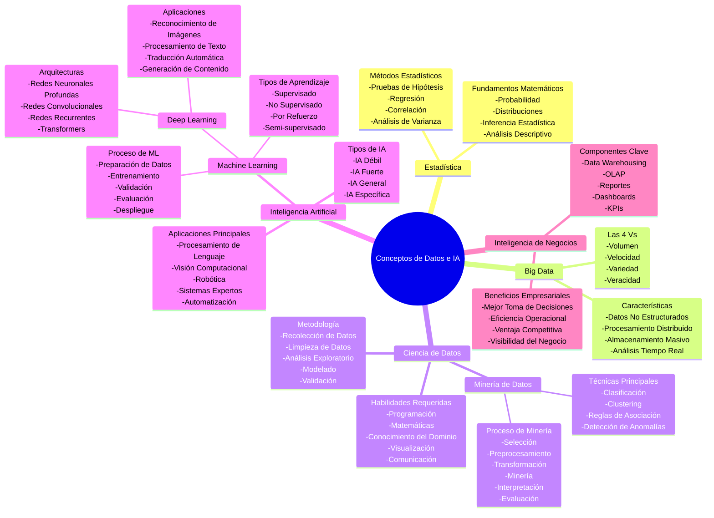

# Conceptos Fundamentales de Datos e Inteligencia Artificial

Este repositorio contiene una guía completa de los conceptos más importantes en el campo de datos e inteligencia artificial, organizados de manera jerárquica para facilitar su comprensión.

## 📋 Tabla de Contenidos

- [Conceptos Fundamentales](#conceptos-fundamentales)
- [Mapa Mental](#mapa-mental)
- [Relaciones Jerárquicas](#relaciones-jerárquicas)
- [Definiciones Detalladas](#definiciones-detalladas)

## 🧠 Conceptos Fundamentales

Los ocho conceptos clave que forman la base del ecosistema de datos e inteligencia artificial:

1. **Estadística** - Fundamento matemático
2. **Big Data** - Manejo de datos masivos
3. **Ciencia de Datos** - Disciplina integradora
4. **Minería de Datos** - Extracción de patrones
5. **Inteligencia Artificial** - Campo más amplio
6. **Machine Learning** - Subcampo de IA
7. **Deep Learning** - Subcampo especializado de ML
8. **Inteligencia de Negocios** - Aplicación empresarial

## 🗺️ Mapa Mental

## 🔗 Relaciones Jerárquicas

### Relaciones de Contención

- **Inteligencia Artificial** ⊃ **Machine Learning** ⊃ **Deep Learning**
- **Ciencia de Datos** ⊃ **Minería de Datos**

### Relaciones de Apoyo

- **Estadística** → Fundamenta ML, Minería de Datos y Ciencia de Datos
- **Big Data** → Alimenta Ciencia de Datos e Inteligencia de Negocios
- **Todos los campos** → Convergen en aplicaciones de Inteligencia de Negocios

## 📚 Definiciones Detalladas

### 📊 Estadística
Ciencia matemática que se ocupa de la recolección, análisis, interpretación y presentación de datos, proporcionando los fundamentos teóricos para muchas otras disciplinas relacionadas.

**Componentes Clave:**
- **Fundamentos Matemáticos**: Probabilidad, distribuciones, inferencia estadística, análisis descriptivo
- **Métodos Estadísticos**: Pruebas de hipótesis, regresión, correlación, análisis de varianza

### 💾 Big Data
Se refiere al manejo de conjuntos de datos extremadamente grandes, complejos y variados que no pueden ser procesados con herramientas tradicionales.

**Características (Las 4 Vs):**
- **Volumen**: Cantidad masiva de datos
- **Velocidad**: Rapidez de generación y procesamiento
- **Variedad**: Diferentes tipos y formatos de datos
- **Veracidad**: Calidad, precisión y confiabilidad de los datos

### 🔬 Ciencia de Datos
Disciplina interdisciplinaria que combina estadística, programación, matemáticas y conocimiento del dominio para extraer insights y conocimiento de datos estructurados y no estructurados.

**Proceso Metodológico:**
- Recolección → Limpieza → Análisis Exploratorio → Modelado → Validación

**Habilidades Requeridas:**
- Programación, matemáticas, conocimiento del dominio, visualización, comunicación

### ⛏️ Minería de Datos
Proceso de descubrir patrones, correlaciones y anomalías en grandes conjuntos de datos utilizando técnicas estadísticas, matemáticas y de machine learning.

**Técnicas Principales:**
- Clasificación, clustering, reglas de asociación, detección de anomalías

**Proceso:**
- Selección → Preprocesamiento → Transformación → Minería → Interpretación → Evaluación

### 🧠 Inteligencia Artificial
Campo amplio de la informática que busca crear sistemas capaces de realizar tareas que normalmente requieren inteligencia humana.

**Tipos:**
- **IA Débil**: Sistemas especializados en tareas específicas
- **IA Fuerte**: Sistemas con capacidades cognitivas generales
- **IA General**: Capacidad de resolver cualquier problema cognitivo
- **IA Específica**: Diseñada para dominios particulares

### 🤖 Machine Learning
Rama de la inteligencia artificial que permite a las máquinas aprender patrones de los datos sin ser programadas explícitamente para cada tarea específica.

**Tipos de Aprendizaje:**
- **Supervisado**: Aprende de datos etiquetados
- **No Supervisado**: Encuentra patrones en datos sin etiquetas
- **Por Refuerzo**: Aprende mediante recompensas y castigos
- **Semi-supervisado**: Combina datos etiquetados y no etiquetados

### 🔥 Deep Learning
Subcampo del machine learning que utiliza redes neuronales artificiales con múltiples capas para modelar y procesar patrones complejos.

**Arquitecturas:**
- **Redes Neuronales Profundas**: Múltiples capas ocultas
- **Redes Convolucionales (CNN)**: Especializadas en imágenes
- **Redes Recurrentes (RNN)**: Para datos secuenciales
- **Transformers**: Para procesamiento de lenguaje natural

### 📈 Inteligencia de Negocios
Conjunto de tecnologías, procesos y estrategias que transforman datos empresariales en información útil para la toma de decisiones estratégicas y operativas.

**Componentes Clave:**
- **Data Warehousing**: Almacenamiento centralizado de datos
- **OLAP**: Procesamiento analítico en línea
- **Reportes**: Informes estructurados
- **Dashboards**: Visualizaciones interactivas
- **KPIs**: Indicadores clave de rendimiento

## 🚀 Casos de Uso

### Aplicaciones Integradas
Estos conceptos trabajan juntos en aplicaciones del mundo real:

1. **E-commerce**: Big Data + ML + BI para sistemas de recomendación
2. **Finanzas**: Estadística + Minería de Datos + IA para detección de fraudes
3. **Salud**: Deep Learning + Ciencia de Datos para diagnóstico médico
4. **Marketing**: BI + ML para segmentación de clientes

## 🏥 Caso de Estudio: IA en el Sector Salud - Stanford Medicine

### **Resumen: Inteligencia Artificial en el Sector Salud en Stanford**

**Ponente**: Profesor de Stanford Medicine y líder en IA para el sector salud que ha estado en Stanford desde 2005, trabajando tanto en investigación académica como en implementación clínica.

### **Antecedentes Clave**
- Stanford ha estado invirtiendo en infraestructura de IA para el sector salud desde 2005 (trayectoria de 20 años)
- El campo de IA en salud se remonta a 1974 en Stanford con Ted Shortliffe
- Comunidad actual de IA en salud: ~3,000 profesores a nivel nacional

### **Conceptos Fundamentales**

**1. Los Datos de Salud son Fundamentalmente Diferentes**
- Los datos de salud existen en líneas de tiempo (todo sucede a lo largo del tiempo)
- Los datos están fragmentados en ~1,200 sistemas de TI
- Dos brechas críticas: nadie tiene registros continuos de 5 años de ningún tipo de dato, y no hay medición completa de todas las modalidades en un solo momento

**2. La IA en Salud Solo Hace Dos Cosas**
- **Clasificación** ("¿Qué es esto?"): Diagnóstico, identificación de condiciones (80-90% de las "predicciones" médicas son en realidad clasificaciones)
- **Predicción** ("¿Qué pasará?"): Pronóstico real de eventos futuros
- **Decisiones de tratamiento**: Si tratar y cómo tratar

### **Tres Niveles de Impacto de la IA Médica**
1. **Ciencia de la Medicina**: Entender mejor las enfermedades (ej: descubrir que la insuficiencia cardíaca con fracción de eyección preservada son en realidad tres condiciones distintas)
2. **Práctica de la Medicina**: Tener pruebas y tratamientos disponibles para uso clínico
3. **Entrega de la Medicina**: Implementar a escala con costo-efectividad comprobada y mejores resultados

### **Ejemplos del Mundo Real**

**Proyecto Botón Verde**: 
- Redujo la línea de tiempo de investigación de 9 meses a 1 día
- Proporciona reportes sobre pacientes similares para toma de decisiones clínicas
- Mejora de velocidad de 137 veces
- Aborda la realidad de que el 80% de las decisiones clínicas carecen de base de evidencia
- Se convirtió en empresa "Atropos Health" en 2021

**Modelo de Predicción de Mortalidad**:
- Predice riesgo de mortalidad de 3-12 meses para conversaciones de planificación de cuidados avanzados
- Proceso simplificado de 48 horas/21 pasos a flujo de trabajo mucho más eficiente
- 15% de mejora en tasas apropiadas de planificación de cuidados avanzados
- 6,700 pacientes recibieron conversaciones que de otra manera se habrían perdido

### **Desafíos Actuales con IA Generativa**

**Problemas de Calidad en Investigación**:
- Encuesta de 520 artículos sobre LLMs médicos encontró que 85-90% no usaron datos reales de pacientes
- La mayoría de estudios se enfocan en responder preguntas de examen USMLE en lugar de tareas clínicas reales
- Cuando se probó en preguntas clínicas reales: 35% de tasa de error en los mejores casos
- Acuerdo de médicos en respuestas de IA: solo alrededor del 50% del tiempo

**Eficiencia vs. Productividad**:
- Estudio mostró cero ahorro de tiempo cuando la IA ayudó con mensajes de pacientes
- En realidad aumentó el tiempo de lectura en 22% (debe leer tanto el mensaje como la respuesta de IA)
- Sin embargo, redujo la carga cognitiva y el sufrimiento del "tiempo en pijama" para los médicos

### **Innovación de Stanford: Modelos de Lenguaje de Líneas de Tiempo**
- Tratar las líneas de tiempo de pacientes como un lenguaje (códigos médicos, procedimientos, medicamentos siguen patrones como gramática)
- Puede entrenar clasificadores efectivos con solo 64 ejemplos en lugar de conjuntos de datos masivos
- Reduce dramáticamente el costo y tiempo de $27 millones/10 años a ciclos de desarrollo mucho más factibles

### **Marco de Implementación de IA de Stanford**
- **30+ aplicaciones de IA activas** en todo el sistema de salud
- Enfoque en cuatro pilares: modelos Justos, Útiles, Confiables y Sostenibles
- Énfasis en capacidad de flujo de trabajo y seguimiento, no solo construcción de modelos
- Integración a través de múltiples líneas de servicio y departamentos
- Equipo de ~1,000 personas incluyendo científicos de datos, investigadores y estudiantes

### **Conclusión Clave**
El éxito en IA para el sector salud requiere equilibrar modelos sofisticados con implementación práctica de flujos de trabajo, asegurando que las predicciones lleven a intervenciones accionables que genuinamente mejoren el cuidado del paciente mientras sean económicamente sostenibles.

### **Aplicación de los Conceptos Fundamentales en este Caso**

Este caso de Stanford demuestra la aplicación práctica de nuestros conceptos fundamentales:

- **📊 Estadística**: Base para modelos de predicción de mortalidad y análisis de efectividad
- **💾 Big Data**: Manejo de datos fragmentados en 1,200 sistemas de TI
- **🔬 Ciencia de Datos**: Metodología completa desde recolección hasta validación de modelos
- **⛏️ Minería de Datos**: Extracción de patrones en historiales médicos complejos
- **🧠 Inteligencia Artificial**: Implementación de sistemas de clasificación y predicción médica
- **🤖 Machine Learning**: Modelos de líneas de tiempo que aprenden de datos históricos de pacientes
- **🔥 Deep Learning**: Redes especializadas para análisis de imágenes médicas y diagnóstico
- **📈 Inteligencia de Negocios**: Dashboards y KPIs para medir impacto en cuidado del paciente y costo-efectividad

## 📖 Recursos Adicionales

### Libros Recomendados
- "Designing Data-Intensive Applications" - Martin Kleppmann
- "The Elements of Statistical Learning" - Hastie, Tibshirani, Friedman
- "Hands-On Machine Learning" - Aurélien Géron

### Cursos Online
- Coursera: Machine Learning (Andrew Ng)
- edX: Introduction to Data Science
- Udacity: Deep Learning Nanodegree

## 🤝 Contribuciones

¿Tienes sugerencias para mejorar este contenido? ¡Las contribuciones son bienvenidas!

1. Fork el repositorio
2. Crea una rama para tu feature
3. Commit tus cambios
4. Push a la rama
5. Abre un Pull Request

## 🔄 Transformers y Grandes Modelos de Lenguaje (LLMs)

### **¿Qué son los Transformers?**

Los **Transformers** son una arquitectura revolucionaria de inteligencia artificial introducida en 2017 por investigadores de Google. Piensa en ellos como un tipo especial de "cerebro artificial" diseñado específicamente para entender y generar lenguaje.

### **a) Ideas Principales de Funcionamiento**

Para entender los Transformers sin complicaciones matemáticas, imaginemos cómo funciona nuestra mente cuando leemos:

#### **1. Atención es Todo lo que Necesitas**
- **Analogía humana**: Cuando lees una oración como "El gato que estaba en el jardín se subió al árbol", tu mente automáticamente conecta "se subió" con "El gato", no con "jardín" o "árbol"
- **En Transformers**: El mecanismo de "atención" permite que el modelo determine qué palabras son importantes para entender cada parte del texto
- **Ventaja**: Puede "prestar atención" a múltiples palabras simultáneamente, como nuestro cerebro

#### **2. Procesamiento Paralelo**
- **Problema anterior**: Los modelos antiguos leían palabra por palabra, como leer con el dedo siguiendo cada letra
- **Solución Transformer**: Pueden "ver" toda la oración de una vez, como cuando tú lees una frase completa de un vistazo
- **Resultado**: Son mucho más rápidos y eficientes

#### **3. Codificadores y Decodificadores**
- **Codificador**: Como un traductor que entiende lo que quieres decir
- **Decodificador**: Como un escritor que expresa las ideas en palabras
- **Juntos**: Crean un sistema que puede tanto entender como generar texto

#### **4. Representaciones Contextuales**
- **Ejemplo**: La palabra "banco" significa algo diferente en "me senté en el banco del parque" vs "deposité dinero en el banco"
- **Transformers**: Entienden que la misma palabra puede tener significados diferentes según el contexto

### **b) Aplicaciones de los Transformers**

#### **Procesamiento de Lenguaje Natural**
- **Traducción automática**: Google Translate, DeepL
- **Resúmenes automáticos**: Resumir artículos largos en párrafos cortos
- **Análisis de sentimientos**: Determinar si un comentario es positivo o negativo
- **Corrección gramatical**: Grammarly, correctores de texto

#### **Generación de Contenido**
- **Escritura creativa**: GPT-4, Claude, ChatGPT para escribir historias, artículos, código
- **Conversación**: Chatbots inteligentes que mantienen conversaciones naturales
- **Código de programación**: GitHub Copilot, que ayuda a programadores
- **Composición musical**: IA que crea melodías y letras

#### **Análisis de Documentos**
- **Búsqueda inteligente**: Encontrar información específica en grandes documentos
- **Clasificación de textos**: Organizar emails, documentos legales, reportes médicos
- **Extracción de información**: Sacar datos importantes de contratos o formularios

#### **Aplicaciones Multimodales**
- **Generación de imágenes**: DALL-E, Midjourney (combinan texto con imágenes)
- **Análisis de imágenes**: Describir qué hay en una foto
- **Video y audio**: Transcripción automática, generación de voces

### **c) Grandes Modelos de Lenguaje (LLMs) y su Relación con Transformers**

#### **¿Qué son los LLMs?**
Los **Grandes Modelos de Lenguaje** son como "bibliotecarios súper inteligentes" que han leído millones de libros, artículos y páginas web, y pueden usar todo ese conocimiento para responder preguntas y ayudar con tareas.

#### **Relación con Transformers**
- **Los Transformers son la arquitectura**: Como los planos de un edificio
- **Los LLMs son el edificio construido**: El resultado final usando esos planos
- **Analogía**: Si Transformer es el "diseño del cerebro", el LLM es el "cerebro entrenado y lleno de conocimiento"

#### **Características de los LLMs**
- **"Grandes"**: Tienen billones de parámetros (como neuronas artificiales)
- **Entrenamiento masivo**: Han "leído" prácticamente todo el internet público
- **Capacidades emergentes**: Pueden hacer cosas que no fueron explícitamente programadas para hacer

#### **Ejemplos Populares**
- **GPT (OpenAI)**: GPT-3, GPT-4, ChatGPT
- **Claude (Anthropic)**: Claude 3, Claude 4
- **LaMDA/Bard (Google)**: Modelos conversacionales de Google
- **LLaMA (Meta)**: Modelos open-source de Facebook

### **d) Cómo se Entrena un LLM Conversacional**

El entrenamiento de un LLM conversacional es como enseñar a un niño a hablar, pero a una escala masiva:

#### **Fase 1: Pre-entrenamiento (Aprender el Lenguaje)**
- **Qué hace**: Como enseñar a un niño a leer dándole millones de libros
- **Datos**: Textos de internet, libros, artículos, Wikipedia
- **Objetivo**: Aprender patrones del lenguaje, gramática, hechos sobre el mundo
- **Resultado**: Un modelo que puede completar frases y generar texto coherente

#### **Fase 2: Entrenamiento de Instrucciones (Aprender a Seguir Órdenes)**
- **Qué hace**: Como enseñar a responder preguntas específicas
- **Datos**: Ejemplos de preguntas y respuestas de alta calidad
- **Proceso**: Mostrar al modelo cómo responder helpfully a diferentes tipos de solicitudes
- **Resultado**: Un modelo que puede seguir instrucciones específicas

#### **Fase 3: Entrenamiento de Refuerzo (Aprender Preferencias Humanas)**
- **Qué hace**: Como enseñar cortesía y preferencias sociales
- **Proceso**: Humanos califican diferentes respuestas del modelo
- **Aprendizaje**: El modelo aprende qué respuestas prefieren los humanos
- **Resultado**: Un asistente que es útil, honesto y seguro

#### **Componentes Técnicos Simplificados**

**Datos de Entrenamiento**:
- Petabytes de texto (equivalente a millones de bibliotecas)
- Conversaciones humanas de alta calidad
- Ejemplos de comportamiento deseado

**Proceso de Aprendizaje**:
- **Predicción**: El modelo aprende a predecir la siguiente palabra
- **Ajuste**: Se corrigen los errores millones de veces
- **Refinamiento**: Se mejora basado en feedback humano

**Recursos Necesarios**:
- Supercomputadoras con miles de GPUs
- Meses de tiempo de procesamiento
- Equipos de cientos de investigadores
- Millones de dólares en costos

#### **Ejemplo Simplificado del Proceso**

1. **Entrada**: "El clima hoy está..."
2. **Predicción**: El modelo predice las próximas palabras más probables
3. **Entrenamiento**: Si la respuesta correcta era "soleado", el modelo ajusta sus "neuronas"
4. **Repetición**: Este proceso se repite billones de veces con diferentes textos
5. **Resultado**: Un modelo que entiende patrones del lenguaje y puede conversar

### **Impacto y Futuro**

#### **Revoluciones Actuales**
- **Democratización de IA**: Cualquier persona puede usar IA avanzada
- **Automatización creativa**: IA que ayuda con tareas creativas e intelectuales
- **Nuevas interfaces**: Conversación natural con computadoras

#### **Desafíos**
- **Costo computacional**: Entrenar y ejecutar estos modelos es muy caro
- **Sesgos**: Pueden reflejar prejuicios presentes en sus datos de entrenamiento
- **Veracidad**: Pueden generar información que suena convincente pero es incorrecta

#### **Conexión con Nuestros Conceptos Fundamentales**

Los Transformers y LLMs representan la culminación de varios de nuestros conceptos:

- **🔥 Deep Learning**: Los Transformers son una arquitectura de deep learning
- **🤖 Machine Learning**: Usan aprendizaje supervisado y por refuerzo
- **💾 Big Data**: Requieren cantidades masivas de datos de entrenamiento
- **🔬 Ciencia de Datos**: Su desarrollo requiere metodologías rigurosas de experimentación
- **📊 Estadística**: Se basan en predicciones probabilísticas de palabras
- **🧠 Inteligencia Artificial**: Representan uno de los avances más significativos en IA

Los LLMs demuestran cómo todos estos conceptos trabajan juntos para crear sistemas que pueden mantener conversaciones naturales con humanos, marcando un hito importante en el desarrollo de la inteligencia artificial.

---

**Nota**: Este documento está diseñado como una guía educativa para comprender las relaciones y aplicaciones de estos conceptos fundamentales en el ecosistema de datos e inteligencia artificial.
