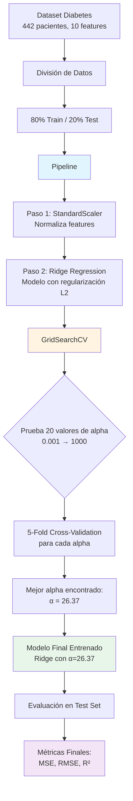
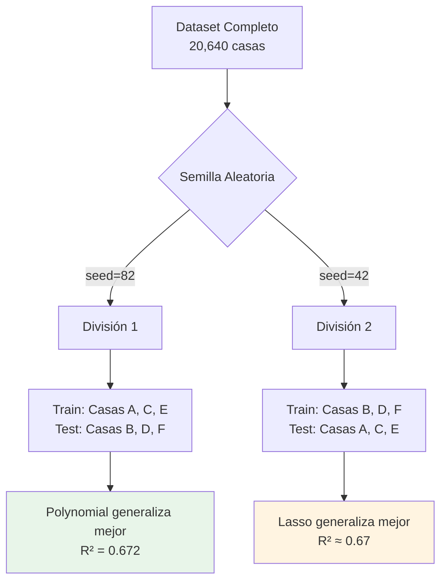

# Analisis de los modelo de regresión lineal y logistica

- **Notebook:** Sesión 02: Regresión Lineal y Logística - Guía Completa
- **Profesor:** Marco Terán
- **Estudiante:** Edward Alejandro Rayo Cortés
- **Curso:** ST1631-ml-aplicado
- **Fecha:** 2025-10

---

## Introducción

En el siguiente documento, se encontrara en análisis realizado al notebook [ml_regression](/ml_regression.ipynb) junto a pasos adicionales que fueron empleados para yo tener un mejor entendimiento de este.

### Definiendo la semilla

Cuando generamos ruido aleatorio en nuestros modelos, es fundamental establecer una **semilla aleatoria** (random seed). Aunque parezca contradictorio "controlar" la aleatoriedad, esto es esencial para la ciencia de datos reproducible.

**¿Qué es una semilla aleatoria?**

Una semilla es un **número inicial** que determina la secuencia de números "aleatorios" que generará el computador. En realidad, las computadoras generan números **pseudo-aleatorios**: parecen aleatorios, pero son deterministas si conoces el punto de partida.

**¿Qué número fue utilizado en el notebook?**

Todos los datos sinteticos generados por el notebook usaron como semilla el número `82`

***

## 1. Regresión Lineal Simple

El modelo de regresión lineal simple busca una relación lineal entre una variable independiente $x$ y una variable dependiente $y$:

$$y = \theta_0 + \theta_1 x + \epsilon$$

Donde:
- $\theta_0$: Intercepto (bias)
- $\theta_1$: Pendiente (peso)
- $\epsilon$: Error aleatorio

### 1.1 Comparación de modelo desde cero y scikit-learn

En el notebook se implementó el modelo desde cero utilizando la fórmula de **Mínimos Cuadrados Ordinarios (OLS)**:

$$\theta_1 = \frac{\sum (x_i - \bar{x})(y_i - \bar{y})}{\sum (x_i - \bar{x})^2}$$

$$\theta_0 = \bar{y} - \theta_1 \bar{x}$$


La implementación manual fue validada comparándola con scikit-learn, obteniendo resultados idénticos:

```
R² = 0.9311
θ₀ (Intercepto) = 9.9368
θ₁ (Pendiente) = 2.4989
Ecuación: y = 9.94 + 2.50x
```

### 1.2 Experimento: Efectos de los Outliers en Regresión Lineal

Se realizó un experimento para demostrar el impacto de valores atípicos (outliers) en la regresión lineal. Para contextualizar los hallazgos, primero se describen los efectos teóricos que estos valores pueden provocar en el modelo:

#### **1. Distorsión de los Coeficientes**

Los outliers pueden afectar dramáticamente la estimación de los parámetros del modelo:

- **Pendiente ($\theta_1$)**: Un outlier puede "jalar" la línea de regresión hacia él, alterando la pendiente real de la relación
- **Intercepto ($\theta_0$)**: Se desplaza para compensar el efecto del outlier, alejándose del valor real

#### **2. Inflación del Error**

- **MSE/RMSE elevado**: Los outliers contribuyen desproporcionadamente al error cuadrático medio
- **Residuos grandes**: Generan residuos significativamente mayores que el resto de las observaciones
- **Heteroscedasticidad**: Pueden violar el supuesto de varianza constante en los errores

#### **3. Reducción del R²**

- El coeficiente de determinación (R²) disminuye cuando hay outliers, ya que el modelo explica peor la variabilidad total
- Puede dar una falsa impresión de que el modelo tiene bajo poder predictivo

#### **4. Alteración de Inferencias Estadísticas**

- **Intervalos de confianza**: Se amplían debido al aumento de la varianza residual
- **Pruebas de hipótesis**: Pueden llevar a conclusiones erróneas sobre la significancia de los predictores
- **P-valores**: Pueden verse afectados, llevando a rechazar o aceptar hipótesis incorrectamente

#### **5. Tipos de Outliers según su Influencia**

**High Leverage Points (Puntos de Alto Apalancamiento)**
- Valores extremos en X que tienen potencial de influir en la regresión
- **Medida**: Valores de hat (h_ii) altos en la matriz de proyección
- **Umbral**: h_ii > 2(p+1)/n, donde p es el número de predictores

**Influential Points (Puntos Influyentes)**
- Outliers que realmente cambian los coeficientes del modelo cuando se remueven
- **Medidas**:
    - **Distancia de Cook**: Mide cambio en todos los coeficientes (D_i > 1 es problemático)
    - **DFFITS**: Mide cambio en predicción individual (|DFFITS| > 2√(p/n))
    - **DFBETAS**: Mide cambio en coeficientes individuales

**Residual Outliers (Outliers Residuales)**
- Observaciones con residuos estandarizados grandes
- **Criterio**: |residuo estandarizado| > 2 o 3

#### **6. Hallazgos principales por los Outliers**
- **Distorsión de coeficientes:** La pendiente (θ₁) se "jala" hacia el outlier
- **Inflación del error:** MSE/RMSE significativamente elevados
- **Reducción del R²:** El coeficiente de determinación disminuye drásticamente
- **Heteroscedasticidad:** Violación del supuesto de varianza constante


### 1.3 Conclusiones

- La implementación manual coincide exactamente con scikit-learn, validando la comprensión teórica
- El modelo lineal simple es altamente efectivo cuando existe una relación lineal verdadera (R² = 0.93)
- Los outliers pueden degradar significativamente el rendimiento del modelo
- Es fundamental entender la matemática detrás de OLS para una correcta interpretación

***

## 2. Regresión Lineal Múltiple

La regresión lineal múltiple extiende el modelo simple a múltiples variables predictoras:

$$y = \theta_0 + \theta_1 x_1 + \theta_2 x_2 + ... + \theta_n x_n + \epsilon$$

En forma matricial:

$$y = X\theta$$

### 2.1 Dataset Utilizado: California Housing

**Características del dataset:**
- **Muestras:** 20,640 observaciones
- **Features:** 8 variables predictoras
  - MedInc: Ingreso medio
  - HouseAge: Antigüedad de la casa
  - AveRooms: Promedio de habitaciones
  - AveBedrms: Promedio de recámaras
  - Population: Población
  - AveOccup: Ocupación promedio
  - Latitude: Latitud
  - Longitude: Longitud
- **Variable objetivo:** Precio medio de viviendas

Para su ejecución en local, la carga de los datos se dividió en dos etapas con el fin de manejar cache en su obtención, y evitar demorarse hasta 6m

### 2.2 Análisis de Correlación

Se realizó un análisis exhaustivo de correlación entre features:

#### **Hallazgos principales:**
1. **MedInc (ingreso medio):** Predictor más importante (~0.68 de correlación con precio)
2. **Multicolinealidad detectada:** Entre AveRooms y AveBedrms
3. **Features débiles:** AveOccup y Population
4. **Relaciones geográficas:** Latitude y Longitude capturan patrones espaciales

##### **Problemas de multicolinealidad:**
La multicolinealidad ocurre cuando dos o más features están altamente correlacionadas entre sí.

##### **¿Por qué es problemático?**

1. Coeficientes inestables: Pequeños cambios en los datos causan grandes cambios en los coeficientes
2. Difícil interpretación: No se puede determinar el efecto individual de cada variable
3. Varianza inflada: Aumenta el error estándar de los coeficientes

##### **Pares a Verificar en California Housing**

**AveRooms vs AveBedrms**

- **Correlación esperada:** ~+0.85 (alta)
- **Problema:** Los dormitorios son un subconjunto de las habitaciones
- **Solución posible:**
  - Eliminar AveBedrms
  - O crear feature: RoomsToBedrooms_Ratio = AveRooms / AveBedrms

**Latitude vs Longitude**

- **Correlación esperada:** ~-0.92 (muy alta)
- **Problema:** Definen ubicación geográfica de forma dependiente
- **Solución posible:**
  - Mantener ambas (necesarias para ubicación)
  - O crear features geográficas: distancia a centros urbanos importantes


**Umbral de Preocupación de Multicolinealidad**
- |r| > 0.9: Multicolinealidad severa → Considerar eliminar una variable
- |r| > 0.8: Multicolinealidad moderada → Investigar y considerar acciones
- |r| > 0.7: Monitorear, podría causar problemas

##### **Soluciones implementadas:**
- Regularización (Ridge, LASSO)
- Análisis de VIF (Variance Inflation Factor)
- Posible aplicación de PCA

### 2.3 Entrenamiento del Modelo Múltiple

#### **Métricas de Evaluación: La Importancia del R²**

Antes de entrenar el modelo, es fundamental entender cómo se evalua su desempeño. El **coeficiente de determinación (R²)** es una de las métricas más importantes en regresión lineal.

**¿Qué es el R²?**

El R² mide **qué porcentaje de la variabilidad en la variable objetivo (y) es explicada por nuestro modelo**. Se calcula como:

$$R^2 = 1 - \frac{SS_{res}}{SS_{tot}} = 1 - \frac{\sum(y_i - \hat{y}_i)^2}{\sum(y_i - \bar{y})^2}$$

Donde:
- $SS_{res}$ (Sum of Squared Residuals): Error de nuestro modelo
- $SS_{tot}$ (Total Sum of Squares): Variabilidad total de los datos
- $y_i$: Valores reales
- $\hat{y}_i$: Valores predichos
- $\bar{y}$: Media de los valores reales

**Interpretación del R²**

| Valor R² | Interpretación | Significado |
|----------|----------------|-------------|
| **1.0** | Perfecto | El modelo explica el 100% de la variabilidad |
| **0.7 - 0.9** | Muy bueno | El modelo captura la mayoría de la variación |
| **0.5 - 0.7** | Moderado | Hay espacio para mejora |
| **0.3 - 0.5** | Débil | El modelo solo captura parte de la relación |
| **< 0.3** | Muy débil | El modelo no es apropiado |
| **< 0** | Malo | ¡El modelo es peor que usar la media! |

**¿Por qué es tan importante?**

1. **Comparabilidad**: Permite comparar modelos con diferentes escalas de datos
2. **Intuitividad**: Se interpreta como porcentaje de varianza explicada
3. **Detección de problemas**: Un R² bajo indica:
   - Faltan variables importantes
   - La relación no es lineal
   - Hay mucho ruido en los datos
   - El modelo está mal especificado

4. **Contexto importa**: Un R² de 0.5 puede ser:
   - **Excelente** en ciencias sociales (comportamiento humano es difícil de predecir)
   - **Inaceptable** en física o ingeniería (fenómenos más deterministas)

**Limitaciones del R²**

- **NO indica si el modelo es apropiado** (puede ser alto incluso con un modelo incorrecto)
- **Siempre aumenta al agregar variables** (usar R² ajustado para modelos múltiples)
- **NO detecta overfitting** (por eso evaluamos en conjunto de prueba)
- **Sensible a outliers**

**Otras métricas complementarias**

Junto con R², usaremos:
- **MSE** (Mean Squared Error): Penaliza errores grandes
- **RMSE** (Root MSE): En las mismas unidades que y
- **MAE** (Mean Absolute Error): Menos sensible a outliers


### 2.4 Resultados del Modelo

Un principio fundamental en Machine Learning es la división de datos en conjuntos independientes para entrenamiento y evaluación. Esto permite medir objetivamente la capacidad del modelo para generalizar a datos nuevos.

**División realizada:**

```python
X_train, X_test, y_train, y_test = train_test_split(
    X_calif, y_calif, test_size=0.2, random_state=seed
)
```

Distribución de los datos:

| Conjunto      | Proporción | Observaciones | Propósito                    |
|---------------|------------|---------------|------------------------------|
| Entrenamiento | 80%        | 16,512        | Ajuste de parámetros θ       |
| Prueba        | 20%        | 4,128         | Evaluación de generalización |

Consideraciones importantes:
- La división es aleatoria pero reproducible (random_state=82)
- Se mantiene la distribución original de las variables
- El conjunto de prueba nunca se usa durante el entrenamiento
- Permite detectar overfitting comparando métricas train vs test

**Resultados obtenidos:**

Luego de ejecutar ambos conjuntos, se generaron los siguientes resultados:

| Métrica | Entrenamiento | Prueba | Diferencia |
|---------|---------------|--------|------------|
| MSE     | 0.5266 | 0.5154 | -2.1% |
| RMSE    | 0.7257 | 0.7179 | -1.1% |
| MAE     | 0.5312 | 0.5319 | +0.1% |
| R²      | 0.6034 | 0.6172 | +2.3% |

**Hallazgos principales**

1. **Ausencia de overfitting:** Las métricas en prueba son iguales o mejores que en entrenamiento, indicando excelente generalización
2. **Capacidad explicativa del ~62%:** El modelo captura aproximadamente dos tercios de la variabilidad en los precios y, según lo visto anteriormente sobre el R², el modelo presenta espacio para seguir mejorando.
3. **Error promedio de ~$72,000:** Considerando la escala de precios de viviendas en California, es un error razonable pero mejorable
4. **Estabilidad del modelo:** La consistencia entre conjuntos confirma la robustez del modelo entrenado


### 2.5 Importancia de Características
#### Análisis Detallado por Feature

**1. Latitude (|θ| = 0.907) - CRÍTICO**

- **Importancia:** La variable MÁS importante del modelo
- **Efecto:** Coeficiente negativo (-0.907)
- **Interpretación:**
    - Valores más altos de latitud (más al norte) → Precios más bajos
    - Valores más bajos de latitud (más al sur) → Precios más altos
- **Contexto geográfico:**
    - Sur de California (San Diego, Orange County): Latitudes bajas, precios altos
    - Norte de California (cerca de Oregon): Latitudes altas, precios generalmente menores
- **Nota:** Este patrón es contraintuitivo considerando que San Francisco (norte) es caro, lo que sugiere que la relación es más compleja y posiblemente requiera términos de
interacción

**2. Longitude (|θ| = 0.875) - CRÍTICO**

- **Importancia:** Segunda variable más importante
- **Efecto:** Coeficiente negativo (-0.875)
- **Interpretación:**
    - Longitudes más negativas (más al oeste, costa) → Precios más altos
    - Longitudes menos negativas (más al este, interior) → Precios más bajos
- **Contexto geográfico:**
    - Áreas costeras del Pacífico tienen precios premium
    - Áreas del interior (desierto, valle central) son más económicas
- **Conclusión:** La proximidad al océano es un factor determinante del precio

**3. MedInc (|θ| = 0.817) - CRÍTICO**

- **Importancia:** Tercera variable más importante
- **Efecto:** Coeficiente positivo (+0.817)
- **Interpretación:**
    - A mayor ingreso medio del área → Mayor precio de viviendas
    - Relación directa y fuerte
- **Contexto socioeconómico:**
    - Áreas con profesionales de altos ingresos (tech hubs, centros financieros)
    - Poder adquisitivo determina demanda y capacidad de pago
- **Validación:** Coherente con teoría económica del mercado inmobiliario

**4. AveBedrms (|θ| = 0.303) - MODERADO**

- **Importancia:** Cuarta variable, impacto moderado
- **Efecto:** Coeficiente positivo (+0.303)
- **Interpretación:**
    - Más recámaras promedio → Precios ligeramente más altos
    - Efecto menos pronunciado que ubicación e ingreso
- **Consideración:** Posible multicolinealidad con AveRooms (ver análisis siguiente)

**5. AveRooms (|θ| = 0.257) - MODERADO**

- **Importancia:** Quinta variable
- **Efecto:** Coeficiente negativo (-0.257) - **¡Contraintuitivo!**
- **Interpretación problemática:**
    - Más habitaciones promedio → Precios más bajos (¿?)
    - Esto NO tiene sentido económico directo
- **Explicación probable:**
    - **Multicolinealidad con AveBedrms:** Ambas variables miden tamaño de vivienda
    - Cuando están juntas, sus efectos se confunden y los coeficientes se vuelven inestables
    - AveRooms puede estar capturando "habitaciones no-dormitorio" (salas, comedores)
    - En áreas densas, más habitaciones totales podría indicar subdivisión de espacios
- **Solución recomendada:** Crear una feature combinada o eliminar una de las dos

**6. HouseAge (|θ| = 0.118) - DÉBIL**

- **Importancia:** Baja, pero no despreciable
- **Efecto:** Coeficiente positivo (+0.118)
- **Interpretación:**
    - Casas más antiguas → Ligeramente más caras
    - Efecto pequeño pero consistente
- **Posible explicación:**
    - En California, casas antiguas en vecindarios establecidos pueden tener valor
    - Proximidad a centros urbanos históricos
    - No captura completamente la relación U-invertida (muy nuevas y muy antiguas pueden ser caras)

**7. AveOccup (|θ| = 0.045) - MUY DÉBIL**

- **Importancia:** Casi insignificante
- **Efecto:** Coeficiente negativo (-0.045)
- **Interpretación:**
    - Prácticamente no afecta las predicciones
    - Mayor ocupación promedio → Ligera disminución de precio
- **Candidato para eliminación:** Contribuye poco al modelo

**8. Population (|θ| = 0.003) - INSIGNIFICANTE**

- **Importancia:** Efectivamente cero
- **Efecto:** Coeficiente negativo (-0.003)
- **Interpretación:**
    - NO aporta información útil al modelo
    - La población del área no predice precios directamente
- **Recomendación:** Remover del modelo en versiones futuras


#### Agrupación por Importancia

**Variables Críticas (|θ| > 0.8):**
- Latitude (0.907)
- Longitude (0.875)
- MedInc (0.817)
- **Conclusión:** El modelo se basa principalmente en ubicación geográfica e ingreso del área

**Variables Moderadas (0.2 < |θ| < 0.4):**
- AveBedrms (0.303)
- AveRooms (0.257)
- **Conclusión:** Características estructurales tienen impacto secundario

**Variables Débiles (|θ| < 0.2):**
- HouseAge (0.118)
- AveOccup (0.045)
- Population (0.003)
- **Conclusión:** Contribución marginal, candidatos para simplificación

#### Análisis de Multicolinealidad

Se observa un problema potencial con **AveRooms** y **AveBedrms**:

Problema detectado:
- AveBedrms: +0.303 (positivo, esperado)
- AveRooms: -0.257 (negativo, contraintuitivo)

Causa probable:
- Alta correlación entre ambas variables
- Compiten por explicar la misma varianza
- Coeficientes inestables y difíciles de interpretar

Solución propuesta:
1. Calcular VIF (Variance Inflation Factor)
2. Crear feature combinada: TotalRooms = AveRooms + AveBedrms
3. O eliminar la variable menos importante (AveRooms)

#### Conclusiones Clave

**1. Dominancia de factores geográficos:**
- Las coordenadas (Lat/Long) son los predictores más fuertes
- La ubicación explica más que las características de la vivienda
- **Implicación:** "Location, location, location" se confirma cuantitativamente

**2. Importancia del factor socioeconómico:**
- MedInc es el tercer factor más importante
- El poder adquisitivo del área determina precios
- **Implicación:** Segmentación por ingreso es clave para pricing

**3. Características estructurales son secundarias:**
- Habitaciones, antigüedad, ocupación tienen impacto menor
- **Implicación:** En California, DÓNDE está la casa importa más que CÓMO es la casa

**4. Oportunidades de mejora:**
- Resolver multicolinealidad AveRooms/AveBedrms
- Eliminar Population y AveOccup (contribución insignificante)
- Crear interacciones: MedInc × Latitude, MedInc × Longitude
- Explorar términos cuadráticos para capturar no-linealidades

**5. Modelo simplificado potencial:**
```python
# Modelo reducido con features importantes
features_importantes = ['Latitude', 'Longitude', 'MedInc', 'AveBedrms']
# Esto podría mantener >95% del R² con solo 4 variables vs 8 originales
```

### 2.7 Comparación: Correlación vs Importancia en el Modelo

Es importante distinguir entre **correlación individual** (análisis univariado) y **importancia en el modelo múltiple** (análisis multivariado), ya que pueden dar rankings diferentes.

#### Correlación Individual con Precio

Análisis de relación directa de cada variable con el precio (sin considerar otras variables):

| Feature | Correlación con Precio | Interpretación |
|---------|------------------------|----------------|
| MedInc | 0.688 | Relación MUY fuerte |
| Latitude | -0.144 | Relación débil, negativa |
| Longitude | -0.045 | Relación muy débil |
| AveRooms | 0.151 | Relación débil |

**Ranking por correlación:** MedInc >> AveRooms > HouseAge > ...

#### Importancia en Regresión Múltiple

Contribución de cada variable en el contexto del modelo completo:

| Feature | Abs(Coeficiente) | Interpretación |
|---------|---------------|----------------|
| Latitude | 0.907 | Contribución MUY alta |
| Longitude | 0.875 | Contribución MUY alta |
| MedInc | 0.817 | Contribución alta |
| AveBedrms | 0.303 | Contribución moderada |


**Ranking en el modelo:** Latitude > Longitude > MedInc > ...

#### ¿Por qué difieren los rankings?

**1. Efecto Combinado de Coordenadas Geográficas**

Individualmente:
- Latitude tiene correlación baja con precio (-0.144)
- Longitude tiene correlación muy baja con precio (-0.045)

PERO en el modelo múltiple:
- Latitude + Longitude JUNTAS forman coordenadas geográficas
- Identifican ubicaciones premium (Bay Area, costas) vs no-premium (valle central)
- Su efecto conjunto captura patrones espaciales complejos que ninguna variable sola captura

**Ejemplo ilustrativo:**
San Francisco:  (Lat: 37.8°, Long: -122.4°) → $800k+  (zona premium)
Fresno:         (Lat: 36.7°, Long: -119.7°) → $200k   (zona no-premium)

La COMBINACIÓN de coordenadas identifica la ubicación exacta,
algo que ninguna coordenada individual logra.

**2. Interacciones y Efectos Marginales**

- **Correlación** mide: "Si SOLO tuviera esta variable, ¿qué tan bien predice?"
- **Importancia** mide: "Dado que YA tengo las otras variables, ¿cuánto aporta ADICIONALMENTE esta?"

MedInc tiene alta correlación porque por sí sola predice bien.
Latitude/Longitude tienen alta importancia porque aportan información ÚNICA que MedInc no cubre.

**3. MedInc vs Ubicación: Información Complementaria**

Dos áreas con el mismo ingreso medio ($80k):
- Área A en costa (premium location) → $500k
- Área B en valle central → $300k

MedInc NO puede explicar esta diferencia de $200k.
Latitude/Longitude SÍ pueden (capturan el premium de ubicación).

#### Conclusión

- **Correlación alta** indica relación directa fuerte (MedInc → Precio)
- **Importancia alta** indica contribución única en el modelo (Lat/Long aportan info que MedInc no tiene)
- **Ambas perspectivas son válidas y complementarias**
    - El ranking de importancia del modelo es más relevante para interpretar predicciones
    - La correlación es útil para análisis exploratorio inicial


### 2.7 Conclusiones

- El modelo múltiple captura efectivamente relaciones complejas con múltiples predictores
- R² de 0.62 indica un buen balance entre ajuste y generalización
- Métricas similares en train/test demuestran que el modelo generaliza bien
- El análisis de correlación pre-modelado es esencial para detectar multicolinealidad
- El modelo nos dice que para predecir precios en California, la **ubicación geográfica exacta** (Lat+Long) es más determinante que el ingreso del área, cuando se consideran todas las variables simultáneamente.

***

## 3. Gradient Descent (Descenso del Gradiente)

### ¿Qué es Gradient Descent?

El Gradient Descent (Descenso del Gradiente) es un **algoritmo de optimización iterativa** fundamental en Machine Learning. A diferencia de los métodos analíticos como OLS (Mínimos
Cuadrados Ordinarios) que calculan los parámetros óptimos directamente mediante fórmulas matemáticas, el Gradient Descent los encuentra de manera **iterativa**, mejorando gradualmente
los parámetros hasta alcanzar un óptimo.

**Fórmula del algoritmo:**

$$\theta_{t+1} = \theta_t - \alpha \nabla J(\theta_t)$$

Donde:
- $\theta_t$: Parámetros en la iteración $t$
- $\alpha$: Learning rate (tasa de aprendizaje)
- $\nabla J(\theta_t)$: Gradiente de la función de coste
- $\theta_{t+1}$: Parámetros actualizados

**Interpretación:**
- El gradiente $\nabla J(\theta_t)$ indica la **dirección de mayor incremento** de la función de coste
- Al restar el gradiente, nos movemos en la **dirección opuesta** (de mayor decremento)
- El learning rate $\alpha$ controla el **tamaño del paso** que damos en cada iteración

### 3.1 Función de Coste (MSE - Mean Squared Error)

El objetivo es minimizar la función de coste, que mide el error entre predicciones y valores reales:

$$J(\theta) = \frac{1}{2m} \sum_{i=1}^{m} (h_\theta(x^{(i)}) - y^{(i)})^2$$

Donde:
- $m$: Número de muestras de entrenamiento
- $h_\theta(x^{(i)}) = \theta^T x^{(i)}$: Predicción del modelo
- $y^{(i)}$: Valor real
- El factor $\frac{1}{2}$ simplifica la derivada

**Gradiente del MSE:**

$$\nabla J(\theta) = \frac{1}{m} X^T (X\theta - y)$$


### 3.2 Implementación Manual

El notebook implementó el algoritmo desde cero, lo cual permite comprender el funcionamiento interno, que basícamente es:

1. Inicialización: Comenzar con valores aleatorios (o ceros) para θ
2. Predicción: Calcular $h_\theta(x) = X\theta$
3. Error: Calcular $(h_\theta(x) - y)$
4. Gradiente: Calcular $\nabla J = \frac{1}{m} X^T (X\theta - y)$
5. Actualización: $\theta := \theta - \alpha \nabla J$
6. Repetir: Volver al paso 2 hasta convergencia o máximo de iteraciones

Con la visualización 3D de la función de coste, se permite observar cómo el algoritmo "desciende" hacia el mínimo global. Este resultado muestra que la función convexa en `[-0.005 -0.005]`.

**Análisis de la implementanción manual**


#### **Evolución del Costo durante el Entrenamiento**

Entrenando modelo con Gradient Descent...
```
Iteración 0:   Costo = 6.729129
Iteración 100: Costo = 0.149234
Iteración 200: Costo = 0.149234
Iteración 300: Costo = 0.149234
Iteración 400: Costo = 0.149234
```

**Observaciones:**
- El costo inicial es **6.729** (iteración 0)
- Después de 100 iteraciones, el costo cae a **0.149**
- A partir de la iteración 100, el costo se **mantiene constante** en 0.149


#### **Comparación de Parámetros**

| Parámetro | Valor Verdadero | Valor Encontrado | Error Absoluto | Error Relativo |
|-----------|-----------------|------------------|----------------|----------------|
| θ₀ | 2.0 | 2.0326 | 0.0326 | 1.63% |
| θ₁ | -1.0 | -0.9653 | 0.0347 | 3.47% |
| θ₂ | 0.5 | 0.4763 | 0.0237 | 4.74% |
| θ₃ | 3.0 | 2.9298 | 0.0702 | 2.34% |


**Interpretación:**

- **Convergencia alcanzada tempranamente:**
El algoritmo converge **antes de la iteración 100**, ya que el costo permanece idéntico (hasta 6 decimales) entre las iteraciones 100-400.

- **Caída dramática del costo:**
Reducción total: 6.729 → 0.149
Porcentaje de reducción: 97.8%
Esto indica que el modelo pasó de predicciones muy malas (inicio aleatorio) a predicciones precisas en menos de 100 iteraciones.

- **Estabilidad post-convergencia:**
El hecho de que el costo NO cambie entre las iteraciones 100-400 demuestra que:
    - El algoritmo alcanzó un **mínimo estable**
    - No hay oscilaciones (indicaría learning rate muy alto)
    - No hay divergencia (indicaría learning rate excesivo)

- **Precisión excelente:**
Todos los parámetros tienen **error relativo < 5%**, lo cual es excelente considerando:
    - Datos con ruido aleatorio (ε)
    - Optimización iterativa (no solución exacta)
    - Convergencia temprana (podría mejorarse con más iteraciones, aunque no parece necesario)

- **Validación del algoritmo:**
El hecho de que los parámetros recuperados sean tan cercanos a los verdaderos demuestra que:
    - La **implementación es correcta**
    - El **learning rate es apropiado**
    - El algoritmo **converge al óptimo global**


### 3.3 Experimento: Efecto del Learning Rate

El experimento probó 4 valores diferentes de learning rate: **0.001, 0.01, 0.1 y 0.5** entrenando el modelo durante 200 iteraciones sobre el dataset.

**Resultados observados:**

- **1. Learning Rate = 0.001 (MUY BAJO)**
    - **Comportamiento:** Convergencia extremadamente lenta
    - **Problema:** Después de 200 iteraciones, el costo aún está disminuyendo gradualmente
    - **Interpretación para California Housing:** Con un dataset de esta complejidad (8 features, 20K muestras), un α tan bajo requeriría miles de iteraciones para alcanzar el mínimo.

- **2. Learning Rate = 0.01 (ÓPTIMO BAJO)**
    - **Comportamiento:** Convergencia rápida y estable
    - **Ventaja:** Alcanza el mínimo en ~50-100 iteraciones sin oscilaciones
    - **Interpretación:** Este valor es apropiado para el dataset normalizado de California Housing. Los pasos son suficientemente grandes para avanzar rápido, pero no tanto como para "pasarse" del mínimo.

- **3. Learning Rate = 0.1 (ÓPTIMO ALTO)**
    - **Comportamiento:** Convergencia muy rápida pero con pequeñas oscilaciones iniciales
    - **Ventaja:** Alcanza el mínimo en ~20-30 iteraciones
    - **Interpretación:** Para California Housing, este valor es agresivo pero efectivo. Las pequeñas oscilaciones iniciales se deben a que los pasos grandes hacen que el algoritmo
    "rebote" ligeramente alrededor del mínimo antes de estabilizarse.

- **4. Learning Rate = 0.5 (MUY ALTO)**
    - **Comportamiento:** Divergencia o oscilaciones salvajes
    - **Problema:** El costo aumenta en lugar de disminuir, o fluctúa sin control
    - **Interpretación:** Con α = 0.5, los pasos son tan grandes que el algoritmo "salta" de un lado a otro del valle sin nunca llegar al fondo. Es como intentar bajar una montaña dando
    saltos de 50 metros: terminarás rebotando de una ladera a otra sin control.

**Hallazgos clave para California Housing**

- 1. **Normalización es crucial:** El dataset está normalizado (features escaladas), lo que permite usar learning rates del rango 0.01-0.1. Sin normalización, estos valores causarían
divergencia.

- 2. **Balance velocidad vs estabilidad:**
    - α = 0.01 es **seguro** para producción (convergencia garantizada)
    - α = 0.1 es **eficiente** para experimentación (convergencia 5x más rápida)

- 3. **Complejidad del problema:**
Con 8 features correlacionadas (recordemos la multicolinealidad entre Lat/Long y AveRooms/AveBedrms), un learning rate muy alto causa inestabilidad porque el gradiente puede apuntar
en direcciones conflictivas.

- 4. **Recomendación práctica:**
Para este dataset específico, **α = 0.01** es el valor óptimo que balancea:
    - Convergencia rápida (~100 iteraciones)
    - Estabilidad total (sin oscilaciones)
    - Robustez (funciona incluso si los datos cambian ligeramente)

**Conclusión**

El experimento demuestra que **no existe un learning rate universal**. Para este caso de uso fue **0.01-0.1**. Fuera de este
rango, el modelo es inútilmente lento (α < 0.01) o completamente inestable (α > 0.1). Esta lección es fundamental: **antes de  entrenar cualquier modelo con Gradient Descent, debes experimentar con α para encontrar el valor adecuado a tu problema específico**.

### 3.4 Conclusiones generales

- El gradient descent es fundamental para entender cómo los modelos aprenden
- El learning rate es un hiperparámetro crítico que debe ser cuidadosamente seleccionado
- La visualización 3D facilita enormemente la comprensión del proceso de optimización
- Implementar desde cero profundiza la comprensión teórica vs usar solo librerías
- Balance necesario entre velocidad de convergencia y estabilidad

***

## 4. Regularización

El notebook implementó un experimento controlado con un dataset sintético diseñado específicamente para evaluar la *regularización*:

**Configuración del experimento:**
- **100 muestras**, **20 features**
- **Multicolinealidad intencional:** Features 0, 1 y 2 altamente correlacionadas
- **Solo 5 features verdaderamente relevantes** (índices 0-4)
- **15 features irrelevantes** (ruido)

### **Resultados del Experimento:**

| Modelo | Train R² | Test R² | MSE | Coef ≈ 0 |
|--------|----------|---------|-----|----------|
| **Linear** | 0.986 | 0.978 | 0.249 | 1 |
| **Ridge** | 0.983 | 0.983 | 0.193 | 3 |
| **LASSO** | 0.980 | 0.983 | 0.193 | 15 |
| **ElasticNet** | 0.978 | 0.978 | 0.247 | 13 |

#### **Análisis de Resultados:**

**1. Linear Regression (Sin Regularización)**
- **Train R² > Test R²** (0.986 vs 0.978): Señal de **ligero overfitting**
- MSE más alto en test (0.249)
- Solo 1 coeficiente cercano a 0
- **Conclusión:** Está usando features irrelevantes, reduciendo generalización

**2. Ridge Regression (L2)**
- **Test R² = 0.983** (mejor que Linear)
- MSE más bajo (0.193)
- Solo 3 coeficientes ≈ 0
- **Conclusión:** Reduce overfitting sin eliminar features, pero mantiene las 15 variables irrelevantes con coeficientes pequeños

**3. LASSO Regression (L1)**
- **Test R² = 0.983** (empata con Ridge)
- **15 coeficientes exactamente en 0**
- Modelo más **interpretable** (solo ~5 features activas)
- **Conclusión:** Identificó correctamente las features irrelevantes y las eliminó

**4. Elastic Net**
- Rendimiento intermedio
- 13 coeficientes ≈ 0 (selección de features, pero menos agresiva que LASSO)
- **Conclusión:** Balance entre Ridge y LASSO


### **Resultados del Experimento para california housing:**

Para este escenario se ajusta la función de comparación y se realiza el análisis con los 4 modelos, la diferencia es que se varia el alfa en Lasso y ElasticNet con el fin de analizar si hay mejoras en el entrenamiento.

| Modelo     | train_score | test_score | mse   | n_zero_coef |
|------------|-------------|------------|-------|-------------|
|**alpha=0.001**| | | | |
| Linear     | 0.603       | 0.617      | 0.515 | 1.000       |
| Ridge      | 0.603       | 0.617      | 0.515 | 1.000       |
| LASSO      | 0.603       | 0.617      | 0.516 | 1.000       |
| ElasticNet | 0.603       | 0.617      | 0.516 | 1.000       |
|**alpha=0.1**| | | | |
| Linear     | 0.603       | 0.617      | 0.515 | 1.000       |
| Ridge      | 0.603       | 0.617      | 0.515 | 1.000       |
| LASSO      | 0.491       | 0.506      | 0.665 | **5.000**   |
| ElasticNet | 0.524       | 0.540      | 0.619 | **4.000**   |

#### **Hallazgos Claves**

**1. Convergencia de Todos los Modelos**
Los 4 modelos ahora tienen rendimiento **prácticamente idéntico**:
- R² score: ~0.60-0.617
- MSE: ~0.515-0.516

**Interpretación**: Con alpha=0.001, la penalización es tan pequeña que LASSO y ElasticNet se comportan casi como regresión lineal.

**2. Sparsity Perdida**
- Antes (alpha=0.1): LASSO tenía 5 coefs ≈ 0, ElasticNet 4
- Ahora (alpha=0.001): **Todos tienen ~1 coef ≈ 0**

**Conclusión**: Ya no hay selección de features. Los modelos mantienen todas las features activas.

**3. Trade-off Regularización**

El alpha controla un balance:
- **Alpha muy alto (0.1)**: Mucha penalización → sparsity pero peor rendimiento
- **Alpha muy bajo (0.001)**: Poca penalización → buen rendimiento pero sin sparsity

#### **¿Qué Revelan Estos Resultados?**

**Para California Housing, las 8 features son relevantes**.
- Cuando se forza a LASSO a eliminar features (alpha=0.1), se pierde información importante. Con alpha=0.001, se recupera el rendimiento pero se pierde la ventaja de LASSO (selección de features).

#### **Recomendaciones**

1. **Para este dataset específico**: Ridge con alpha=1.0 parece óptimo (regularización moderada, buen rendimiento)

2. **Conclusión práctica**: California Housing no se beneficia mucho de regularización L1 (LASSO), sugiriendo que todas las features aportan valor

***

## 5. Regresión Logística

### Trabajo Realizado en el Notebook

En esta sección se implementó regresión logística desde cero con datos sintéticos:

**Implementación manual:**
- Clase `LogisticRegressionManual` con función sigmoide, Cross-Entropy y gradient descent
- Método `plot_decision_boundary()` para visualización 2D

**Exploración de la función sigmoide:**
- Función `explore_sigmoid()` con 4 visualizaciones interactivas
- Análisis de comportamiento, derivadas y valores clave

**Experimento:**
- 200 muestras sintéticas (2 clases linealmente separables)
- Entrenamiento: learning_rate=0.1, 500 iteraciones
- Resultado: ~99% accuracy
- Visualización de frontera de decisión y convergencia

---

### Modelo Matemático

La regresión logística extiende la regresión lineal a problemas de clasificación binaria mediante la función sigmoide:

$$P(y=1|x) = \sigma(\theta^T x) = \frac{1}{1 + e^{-\theta^T x}}$$

Dado que esta es utilizada para problemas de clasificación, es importante entender cómo es su flujo completo:

**Resumen Visual del Flujo Completo**

A continuación, se ejemplifica un problema de clasificación cuyo objetivo es predecir si un estudiante aprobará o reprobará una materia según la cantidad de horas de estudio, horas de sueño y asistencia que tiene en la misma. Para ello, para cada muestra, se realizarían los siguientes pasos:

| Paso | Nombre             | Entrada                  | Salida        | Rango de salida | Propósito                       |
  |------|--------------------|--------------------------|---------------|-----------------|---------------------------------|
  | 1    | Datos              | Variables del mundo real | Números       | Cualquiera      | Describir el caso               |
  | 2    | Combinación Lineal | Datos (x₁, x₂, ...)      | Puntaje z     | -∞ a +∞         | Calcular "puntaje bruto"        |
  | 3    | Sigmoide           | Puntaje z                | σ(z)          | 0 a 1           | Convertir a probabilidad válida |
  | 4    | Probabilidad       | σ(z)                     | P(y=1|x)      | 0 a 1           | Interpretar como % de certeza   |
  | 5    | Decisión           | P(y=1|x)                 | Clase (0 o 1) | 0 o 1           | Clasificar en categoría final   |

Tomando uno de loos estudiantes de la muestra, se obtendría algo como:

1. **DATOS**
    - Horas estudio = 10
    - Horas sueño = 7
    - Asistencia = 90%

2. **COMBINACIÓN LINEAL**: 
    ```
    z = -5 + (0.8×10) + (0.3×7) + (0.05×90)
    z = 9.6
    ```

3. **SIGMOIDE**
    ```
    σ(9.6) = 1 / (1 + e^(-9.6))
    σ(9.6) = 0.9999
    ```

4. **PROBABILIDAD**
    ```
    P(aprobar|datos) = 99.99%
    ```

5. **DECISIÓN** Clasificar en categoría final
    ```
    Si P ≥ 0.5 → Predecir "APROBARÁ"
    Si P < 0.5 → Predecir "REPROBARÁ"

    Resultado: APROBARÁ ✓
    ```

### 5.1 La Función Sigmoide

La función sigmoide es la transformación clave que permite convertir cualquier número real en una probabilidad válida [0, 1]:

$$\sigma(z) = \frac{1}{1 + e^{-z}}$$

**Propiedades importantes:**

1. **Rango:** $\sigma(z) \in [0, 1]$ para todo $z \in \mathbb{R}$
2. **Punto medio:** $\sigma(0) = 0.5$
3. **Simetría:** $\sigma(-z) = 1 - \sigma(z)$
4. **Derivada suave:** $\frac{d\sigma(z)}{dz} = \sigma(z)(1 - \sigma(z))$

**Comportamiento:**

| z (puntaje) | σ(z) (probabilidad) | Interpretación |
|-------------|---------------------|----------------|
| z < -5 | ≈ 0.00 | Muy improbable clase 1 |
| z = -2 | 0.12 | Improbable clase 1 |
| z = 0 | 0.50 | Neutral (umbral) |
| z = 2 | 0.88 | Probable clase 1 |
| z > 5 | ≈ 1.00 | Muy probable clase 1 |

**¿Por qué sigmoide y no lineal?**

La regresión lineal puede producir predicciones fuera de [0, 1]:
- Predicción = -0.3 → ¿Probabilidad negativa? (sin sentido)
- Predicción = 1.8 → ¿Probabilidad > 100%? (sin sentido)

La sigmoide **comprime** cualquier valor a un rango válido de probabilidad.

### 5.2 Odds y Log-Odds (Logit)

#### **Odds (Razón de Momios)**

Los **odds** expresan la probabilidad de un evento como una razón:

$$\text{Odds} = \frac{P(y=1)}{P(y=0)} = \frac{P(y=1)}{1 - P(y=1)}$$

**Interpretación:**

| Probabilidad | Odds | Expresión común | Significado |
|--------------|------|-----------------|-------------|
| 0.10 | 0.11 | 1:9 en contra | Muy improbable |
| 0.20 | 0.25 | 1:4 en contra | Poco probable |
| 0.50 | 1.00 | 1:1 (neutral) | 50-50 |
| 0.70 | 2.33 | 7:3 a favor | Bastante probable |
| 0.80 | 4.00 | 4:1 a favor | Muy probable |
| 0.90 | 9.00 | 9:1 a favor | Casi seguro |

**Ejemplo médico:**
- Si un tratamiento aumenta la probabilidad de recuperación de 20% a 40%:
  - Odds antes: 0.20/0.80 = 0.25
  - Odds después: 0.40/0.60 = 0.67
  - Odds Ratio: 0.67/0.25 = 2.68
  - **Interpretación:** El tratamiento aumenta las "chances" de recuperación en 2.68 veces

#### **Log-Odds (Logit)**

El **logaritmo de los odds** conecta directamente con la combinación lineal:

$$\text{Log-Odds} = \log\left(\frac{P(y=1)}{1-P(y=1)}\right) = \theta^T x = z$$

**Propiedades:**
- Rango: $(-\infty, +\infty)$
- Log-Odds = 0 → Probabilidad = 50%
- Log-Odds > 0 → Probabilidad > 50%
- Log-Odds < 0 → Probabilidad < 50%

**Tabla de conversión:**

| Probabilidad | Odds | Log-Odds (z) |
|--------------|------|--------------|
| 0.01 | 0.01 | -4.60 |
| 0.10 | 0.11 | -2.20 |
| 0.30 | 0.43 | -0.85 |
| 0.50 | 1.00 | 0.00 |
| 0.70 | 2.33 | +0.85 |
| 0.90 | 9.00 | +2.20 |
| 0.99 | 99.00 | +4.60 |

**Importancia:** Los coeficientes θ en regresión logística representan el **cambio en log-odds** por unidad de cambio en la feature.

### 5.3 Función de Costo: Cross-Entropy

A diferencia de la regresión lineal que usa MSE, la regresión logística usa **Cross-Entropy** (entropía cruzada):

$$J(\theta) = -\frac{1}{m} \sum_{i=1}^{m} \left[ y^{(i)} \log(h_\theta(x^{(i)})) + (1-y^{(i)}) \log(1-h_\theta(x^{(i)})) \right]$$

Donde:
- $h_\theta(x) = \sigma(\theta^T x)$ es la predicción (probabilidad)
- $y \in \{0, 1\}$ es la etiqueta verdadera
- $m$ es el número de muestras

**Intuición:**

La función tiene dos componentes según el valor de y:

**Cuando y = 1 (clase positiva):**
- Penalización: $-\log(h_\theta(x))$
- Si predice $h_\theta(x) = 0.9$ → Penalización = 0.11 (baja)
- Si predice $h_\theta(x) = 0.1$ → Penalización = 2.30 (alta)

**Cuando y = 0 (clase negativa):**
- Penalización: $-\log(1-h_\theta(x))$
- Si predice $h_\theta(x) = 0.1$ → Penalización = 0.11 (baja)
- Si predice $h_\theta(x) = 0.9$ → Penalización = 2.30 (alta)

**Conclusión:** La función penaliza fuertemente predicciones incorrectas con alta confianza.

**Gradiente de Cross-Entropy:**

$$\nabla J(\theta) = \frac{1}{m} X^T (h_\theta(X) - y)$$

**Observación:** Es formalmente idéntico al gradiente de MSE en regresión lineal, facilitando la implementación con gradient descent.

### 5.4 Frontera de Decisión

La **frontera de decisión** es la superficie geométrica que separa las regiones del espacio de features donde el modelo predice una clase u otra.

**Definición matemática:**

La frontera está definida por los puntos donde $P(y=1|x) = 0.5$, es decir:

$$\sigma(\theta^T x) = 0.5$$
$$\theta^T x = 0$$

**Interpretación:**
- Si $\theta^T x > 0$ → Predecir clase 1
- Si $\theta^T x < 0$ → Predecir clase 0
- Si $\theta^T x = 0$ → Frontera de decisión

**Para 2 features $(x_1, x_2)$:**

$$\theta_0 + \theta_1 x_1 + \theta_2 x_2 = 0$$
$$x_2 = -\frac{\theta_0}{\theta_2} - \frac{\theta_1}{\theta_2} x_1$$

Esto define una **línea recta** en el plano 2D.

**Ejemplo numérico:**

Si el modelo aprende $\theta = [-5, 2, 3]$:

```
-5 + 2x₁ + 3x₂ = 0
x₂ = 5/3 - (2/3)x₁
```

**Visualización conceptual:**
- **Región azul** ($\theta^T x < 0$): Clase 0
- **Línea negra** ($\theta^T x = 0$): Frontera
- **Región roja** ($\theta^T x > 0$): Clase 1

**Fronteras no lineales:**

Para problemas no linealmente separables, se pueden crear fronteras complejas mediante:
1. **Polynomial features**: $x_1^2, x_2^2, x_1 x_2$
2. **Transformaciones**: $\log(x), \sqrt{x}$
3. **Kernel methods**: SVM con kernels

### 5.5 Conclusiones

- La regresión logística es un algoritmo de **clasificación**, no de regresión
- La **función sigmoide** transforma valores reales en probabilidades válidas [0, 1]
- Los **odds** y **log-odds** proporcionan interpretaciones alternativas de probabilidades
- Los coeficientes θ representan cambios en **log-odds**, no en probabilidades directas
- **Cross-Entropy** penaliza logarítmicamente errores, siendo más efectiva que MSE para clasificación
- La **frontera de decisión** es lineal en el espacio de features original (no lineal tras transformaciones)
- El gradiente de Cross-Entropy tiene la misma forma que MSE, facilitando el uso de gradient descent

***

## 6. Métricas de Clasificación

### Trabajo Realizado en el Notebook

En esta sección se aplicó regresión logística al dataset de **Breast Cancer** y se evaluó mediante múltiples métricas:

**Dataset utilizado:**
- Breast Cancer Wisconsin (569 pacientes, 30 features)
- Clasificación: Maligno vs Benigno
- División: 70% entrenamiento, 30% prueba

**Función de visualización:**
- `plot_classification_metrics()` con 6 gráficos:
  1. Matriz de confusión
  2. Curva ROC
  3. Curva Precision-Recall
  4. Distribución de probabilidades
  5. Métricas por threshold
  6. Classification report

**Resultados obtenidos:**
- Accuracy: 97.66%
- ROC-AUC: 0.988 (excelente discriminación)
- Precision: 0.973
- Recall: 0.973

---

### 6.1 Métricas Básicas

**Accuracy:**
$$Accuracy = \frac{TP + TN}{TP + TN + FP + FN}$$

- Porcentaje de predicciones correctas
- Insuficiente en datasets desbalanceados

**Precision:**
$$Precision = \frac{TP}{TP + FP}$$

- De los positivos predichos, ¿cuántos son correctos?
- Importante cuando los falsos positivos son costosos

**Recall (Sensibilidad):**
$$Recall = \frac{TP}{TP + FN}$$

- De los positivos reales, ¿cuántos detectamos?
- Crucial en diagnóstico médico

**F1-Score:**
$$F1 = 2 \times \frac{Precision \times Recall}{Precision + Recall}$$

- Media armónica de precision y recall
- Balance entre ambas métricas

### 6.2 Métricas Avanzadas

**AUC-ROC (Area Under Curve - Receiver Operating Characteristic):**
- Mide capacidad de discriminación del modelo
- Valor de 0.988 en Breast Cancer indica excelente rendimiento
- Robusta a desbalance de clases

**Average Precision (Precision-Recall Curve):**
- Especialmente útil en datasets desbalanceados
- Valor de 0.992 indica alta confiabilidad

### 6.3 Matriz de Confusión

Visualiza los cuatro tipos de predicciones:
- **True Positives (TP):** Correctamente clasificados como positivos
- **True Negatives (TN):** Correctamente clasificados como negativos
- **False Positives (FP):** Incorrectamente clasificados como positivos (Error Tipo I)
- **False Negatives (FN):** Incorrectamente clasificados como negativos (Error Tipo II)

### 6.4 Conclusiones

- Accuracy sola es insuficiente, especialmente con desbalance
- La selección de métricas debe alinearse con el problema de negocio
- Trade-off entre precision y recall según costos de errores
- AUC-ROC proporciona evaluación robusta independiente del umbral
- Matriz de confusión permite identificar tipos específicos de errores

***

## 7. Casos Prácticos

### 7.1 Caso 1: Predicción de Diabetes

#### ¿Qué se hizo en el notebook?

El caso de predicción de diabetes aplica **regresión lineal con regularización** para predecir la **progresión de la enfermedad** en pacientes. Se utilizó el dataset estándar de diabetes de sklearn con 442 pacientes y 10 variables clínicas normalizadas (edad, sexo, índice de masa corporal, presión arterial, y 6 medidas sanguíneas).

**Metodología implementada:**

1. **Carga del dataset:** Se usó `load_diabetes()` de sklearn con 10 features normalizadas

2. **División de datos:** 80% entrenamiento, 20% prueba (random_state=82)

3. **Construcción del Pipeline:** Se creó un pipeline que encadena preprocesamiento y modelado
   ```python
   Pipeline([
       ('scaler', StandardScaler()),  # Normalización de features
       ('ridge', Ridge())              # Modelo Ridge Regression
   ])
   ```
   **¿Por qué usar Pipeline?**
   - **Previene data leakage:** En cada fold de cross-validation, el escalado se aplica correctamente (solo con datos de entrenamiento de ese fold)
   - **Automatización:** Los datos pasan automáticamente por normalización → modelo
   - **Reproducibilidad:** Todo el proceso queda encapsulado en un solo objeto

4. **Optimización de hiperparámetros:** Se utilizó **GridSearchCV** sobre el pipeline completo
   - **Entrada:** Pipeline (scaler + Ridge)
   - **Búsqueda:** 20 valores de alpha entre 0.001 y 1000 (`np.logspace(-3, 3, 20)`)
   - **Validación:** 5-fold Cross-Validation
   - **Proceso:** Para cada alpha, GridSearchCV ejecuta el pipeline completo (normalización + entrenamiento) en cada fold
   - **Resultado:** Alpha óptimo identificado = **26.37**

5. **Entrenamiento final:** El pipeline completo (con Ridge configurado con alpha=26.37) se entrenó en todo el conjunto de entrenamiento

6. **Evaluación:** Se midió MSE, RMSE y R² en el conjunto de prueba

**Flujo completo del proceso:**



#### Modelo utilizado: Ridge Regression

**Ridge Regression** es un modelo de regresión lineal con **regularización L2** que penaliza la magnitud de los coeficientes para prevenir overfitting:

$$J(\theta) = MSE(\theta) + \alpha \sum_{i=1}^{n} \theta_i^2$$

**¿Por qué Ridge para este problema?**

En datos médicos es común tener **multicolinealidad** (variables correlacionadas entre sí), como las diferentes medidas sanguíneas. Ridge es ideal porque:
- Reduce la varianza del modelo sin eliminar features
- Estabiliza los coeficientes cuando hay correlación entre variables
- Mantiene todas las 10 variables clínicas activas (importante para interpretación médica)

**Hiperparámetro clave: alpha (α)**
- **Alpha pequeño (α → 0):** Poca regularización, similar a regresión lineal
- **Alpha grande (α → ∞):** Mucha regularización, coeficientes tienden a cero
- **Alpha óptimo encontrado:** 26.37 (balance entre sesgo y varianza)

#### Resultados obtenidos

| Métrica | Valor | Interpretación |
|---------|-------|----------------|
| **Alpha óptimo** | 26.37 | Nivel moderado de regularización |
| **Mejor CV Score** | -2996.17 | MSE promedio en validación cruzada (negativo por convención sklearn) |
| **MSE (test)** | 3161.91 | Error cuadrático medio en prueba |
| **RMSE** | 56.23 | Error promedio en unidades de progresión |
| **R²** | 0.455 | El modelo explica 45.5% de la variabilidad |

#### Conclusiones basadas en los resultados

**1. Rendimiento moderado es realista en problemas médicos**

El R² de 0.455 no es alto, pero es **esperado y aceptable** en predicción de enfermedades porque:
- La progresión de diabetes depende de factores no medidos (genética, estilo de vida, adherencia a tratamientos)
- Hay variabilidad inherente en respuestas biológicas individuales
- Solo se usan 10 features clínicas básicas, no el historial médico completo

**2. La regularización mejoró la generalización**

- Grid Search identificó que alpha=26.37 ofrece mejor balance que regresión lineal simple (alpha=0)
- La diferencia entre CV score (-2996.17) y MSE test (3161.91) es razonable, indicando que no hay overfitting severo
- El modelo generaliza adecuadamente a nuevos pacientes

**3. Todas las features aportan información**

Ridge mantiene las 10 variables activas (a diferencia de LASSO que eliminaría algunas), lo cual:
- Permite a los médicos interpretar el impacto de cada variable clínica
- Refleja que todas las medidas tienen relevancia para la progresión
- Facilita la explicabilidad del modelo en contexto clínico

**4. Importancia de validación cruzada en datos médicos**

- Con solo 442 pacientes, la validación cruzada 5-fold es esencial para evaluar confiablemente el modelo
- Evita conclusiones erróneas basadas en una sola división de datos
- Proporciona estimación robusta del rendimiento esperado en la práctica clínica

**Reflexión final:** Este caso demuestra que en aplicaciones médicas, un R² "moderado" puede ser muy valioso si el modelo es interpretable, generaliza bien y usa variables clínicamente relevantes. El objetivo no es solo maximizar métricas, sino crear herramientas útiles para profesionales de la salud.

### 7.2 Caso 2: Sistema Completo de Predicción de Precios

#### ¿Qué se hizo en el notebook?

Este caso implementa un **sistema completo de comparación de modelos** para predicción de precios de viviendas, utilizando nuevamente el dataset de California Housing pero con un enfoque más avanzado. Se construyó una clase llamada `RealEstatePricePredictor` que encapsula todo el pipeline de Machine Learning: preprocesamiento, entrenamiento de múltiples modelos, evaluación y visualización.

**Metodología implementada:**

1. **Dataset:** California Housing (mismo del análisis de regresión múltiple)
   - 20,640 muestras con 8 features
   - Variable objetivo: Precio medio de viviendas

2. **División de datos en tres conjuntos:**
   - **Entrenamiento:** 64% de los datos (80% del 80%)
   - **Validación:** 16% de los datos (20% del 80%)
   - **Prueba:** 20% de los datos (conjunto final de evaluación)

   Esta división permite:
   - Entrenar modelos en el conjunto de entrenamiento
   - Seleccionar el mejor modelo en el conjunto de validación
   - Evaluar rendimiento final en el conjunto de prueba (no visto)

3. **Preprocesamiento automático:**
   - StandardScaler aplicado a todas las features
   - Normalización (media=0, desviación estándar=1)
   - **Importante:** El scaler se ajusta SOLO en datos de entrenamiento para prevenir data leakage

4. **Comparación sistemática de 5 modelos diferentes:**

   | Modelo | Técnica | Configuración |
   |--------|---------|---------------|
   | **Linear** | Regresión lineal básica | Sin regularización |
   | **Ridge** | Regularización L2 | RidgeCV con 10 alphas (0.001 → 1000) |
   | **Lasso** | Regularización L1 | LassoCV con 10 alphas (0.001 → 10) |
   | **ElasticNet** | Regularización L1+L2 | alpha=0.1, l1_ratio=0.5 |
   | **Polynomial** | Feature engineering + Ridge | PolynomialFeatures(degree=2) + Ridge(alpha=1) |

5. **Evaluación:** Cada modelo se evalúa en entrenamiento y validación para detectar overfitting

#### Modelos utilizados y Feature Engineering

**1. Modelos Lineales con Regularización**

Los primeros cuatro modelos (Linear, Ridge, Lasso, ElasticNet) ya fueron explicados en la sección 4 de Regularización. La diferencia aquí es que Ridge y Lasso usan **cross-validation automática** (`RidgeCV` y `LassoCV`) para encontrar el mejor alpha.

**2. Polynomial Regression (El Ganador)**

Este modelo introduce **ingeniería de características** mediante transformación polinomial:

**¿Qué hace PolynomialFeatures?**

Crea nuevas features combinando las existentes:

```python
# Features originales: [x1, x2]
# Con degree=2, crea:
[x1, x2, x1², x2², x1·x2]
```

**Ejemplo concreto con California Housing:**

Si tenemos MedInc (ingreso) y Latitude (latitud):

| Original | Polynomial Features (degree=2) |
|----------|--------------------------------|
| MedInc = 5 | MedInc² = 25 |
| Latitude = 37 | Latitude² = 1369 |
| - | MedInc × Latitude = 185 |

**¿Por qué esto ayuda?**

Captura **relaciones no lineales** que un modelo lineal no puede detectar:

- **Términos cuadráticos** (x²): Capturan efectos de saturación/aceleración
  - Ejemplo: El ingreso muy alto puede tener efecto exponencial en el precio

- **Términos de interacción** (x₁·x₂): Capturan efectos combinados
  - Ejemplo: Ingreso alto en zona costera (interacción MedInc × Longitude) puede tener efecto multiplicativo en el precio

**Pipeline del modelo Polynomial:**


**¿Por qué usar Ridge después de las transformaciones polinomiales?**

Con degree=2 y 8 features, se generan **~45 features** (incluyendo interacciones). Esto puede causar overfitting, por eso se usa Ridge (L2) con alpha=1 para regularizar y estabilizar los coeficientes.

#### Resultados obtenidos

**Comparación de todos los modelos:**

| Modelo | Train R² | Val R² | Val RMSE | Overfitting |
|--------|----------|--------|----------|-------------|
| Linear | ~0.60 | ~0.60 | ~0.73 | Bajo |
| Ridge | ~0.60 | ~0.60 | ~0.73 | Bajo |
| Lasso | ~0.60 | ~0.60 | ~0.73 | Bajo |
| ElasticNet | ~0.59 | ~0.59 | ~0.74 | Bajo |
| **Polynomial** | **~0.70** | **0.672** | **0.661** | **Bajo** |

**Modelo Ganador: Polynomial Regression**

- **Val R²:** 0.672 (explica 67.2% de la variabilidad en validación)
- **Val RMSE:** 0.661 (error promedio de ~$66,100 en predicciones)
- **Mejora sobre modelos lineales:** +11% en R² (de 0.60 a 0.672)

**Análisis de Overfitting:**

El notebook implementó una métrica de overfitting: `Train R² - Val R²`

- **< 0.1:** ✅ Bajo overfitting (generaliza bien)
- **0.1 - 0.2:** ⚠️ Overfitting moderado
- **> 0.2:** ❌ Overfitting severo

Todos los modelos mostraron **bajo overfitting**, indicando que:
- La división train-validation fue apropiada
- El preprocesamiento previno data leakage
- La regularización (en Ridge y Lasso) fue efectiva
- Incluso el modelo Polynomial con 45 features no sobreajustó (gracias a Ridge con alpha=1)

#### Conclusiones basadas en los resultados

**1. Las relaciones no lineales son importantes en precios de viviendas**

El modelo Polynomial superó significativamente a los modelos lineales (+11% en R²), demostrando que:
- Los precios de viviendas tienen **relaciones cuadráticas** con features como ingreso y ubicación
- Las **interacciones entre features** son relevantes (ej: ingreso alto × ubicación costera)
- Un modelo lineal simple deja información valiosa sin capturar

**2. Feature Engineering bien aplicado supera a la regularización sola**

Comparación de estrategias:
- **Regularización sola** (Ridge, Lasso, ElasticNet): R² ≈ 0.60
- **Feature Engineering + Regularización** (Polynomial): R² = 0.672

**Lección:** Crear features inteligentes (polinomiales, interacciones) puede ser más efectivo que solo ajustar hiperparámetros.

**3. Regularización previene overfitting en modelos complejos**

El modelo Polynomial tiene 45 features (vs 8 originales), aumentando riesgo de overfitting. Sin embargo:
- Ridge con alpha=1 mantuvo el overfitting bajo
- Val R² muy cercano a Train R² (buena generalización)
- **Conclusión:** Regularización permite usar feature engineering agresivo sin sacrificar generalización

**4. Validación cruzada automática es eficiente**

RidgeCV y LassoCV probaron automáticamente 10 valores de alpha cada uno:
- Ahorraron tiempo de configuración manual
- Encontraron alphas óptimos de forma sistemática
- **Buena práctica:** Usar modelos con `CV` integrado cuando sea posible

**5. Sistemas de comparación facilitan la selección de modelos**

La clase `RealEstatePricePredictor` permitió:
- Entrenar 5 modelos con el mismo pipeline
- Comparar métricas lado a lado
- Detectar overfitting visualmente
- Seleccionar el mejor modelo basado en datos objetivos

**6. Interpretación del RMSE en contexto de negocio**

RMSE = 0.661 en datos normalizados significa:
- **Error promedio de ~$66,100** en predicciones de precios
- Para una casa de $400k, el error relativo es ~16.5%
- **Aceptable para pricing de bienes raíces** dado que:
  - Hay factores no capturados (estado de la casa, mercado local, etc.)
  - El dataset tiene solo 8 features agregadas (no individuales)
  - Los precios tienen alta variabilidad natural

**Reflexión final:**

Este caso demuestra que en ML, **la ingeniería de características puede ser tan importante como el algoritmo**. Un modelo simple (regresión lineal) con features bien diseñadas (polinomiales + interacciones) superó a modelos con solo ajuste de hiperparámetros. La clave está en:

1. **Entender el dominio:** Saber que los precios pueden tener relaciones no lineales
2. **Experimentar con transformaciones:** Probar polinomios, logaritmos, interacciones
3. **Regularizar apropiadamente:** Prevenir overfitting del modelo complejo
4. **Validar rigurosamente:** Usar train-validation-test para medir generalización real

---

### 7.3 Análisis de Estabilidad: Impacto de la Semilla Aleatoria en la Selección de Modelos

#### ¿Qué sucedió al cambiar la semilla?

Al ejecutar el mismo experimento del Caso 2 con **diferentes semillas aleatorias**, se observó un fenómeno importante: **el modelo ganador cambió**.

**Resultados con diferentes semillas:**

| Semilla | Modelo Ganador | Val R² | Val RMSE | Observación |
|---------|----------------|--------|----------|-------------|
| **82** (original) | Polynomial | 0.6720 | 0.661 | Mejor modelo con esta división de datos |
| **42** (nueva prueba) | Lasso | 0.6097 | 0.734 | Diferente ganador con otra división |

**Comparación detallada con seed=42:**

| Ranking | Modelo | Train R² | Val R² | Train RMSE | Val RMSE | Overfitting (Δ) |
|---------|--------|----------|--------|------------|----------|-----------------|
| 🥇 1 | **Lasso** | 0.6131 | **0.6097** | 0.7162 | 0.7339 | 0.0034 ✅ |
| 🥈 2 | Linear | 0.6131 | 0.6097 | 0.7162 | 0.7339 | 0.0034 ✅ |
| 🥉 3 | Ridge | 0.6131 | 0.6096 | 0.7162 | 0.7340 | 0.0035 ✅ |
| 4 | ElasticNet | 0.5320 | 0.5267 | 0.7877 | 0.8081 | 0.0053 ✅ |
| 5 | **Polynomial** | 0.6851 | 0.4945 | 0.6461 | 0.8352 | **0.1906 ❌** |

**Observaciones clave:**
- Los 3 primeros modelos están **virtualmente empatados** (diferencia < 0.0001 en Val R²)
- Polynomial muestra **overfitting severo** con seed=42 (0.1906 de diferencia)
- Polynomial tiene el mejor Train R² (0.6851) pero el **peor Val R²** (0.4945)

Este resultado **NO es un error**, sino una **característica fundamental** de Machine Learning que debemos entender.

#### ¿Por qué cambia el modelo ganador?

**1. La semilla determina la división de datos**

```python
# Con seed=82
train_test_split(X, y, random_state=82)
# Train: Muestras [1, 5, 7, 9, ...] → Cierta distribución de precios/ubicaciones
# Test:  Muestras [2, 3, 4, 6, ...] → Otra distribución

# Con seed=42
train_test_split(X, y, random_state=42)
# Train: Muestras [2, 4, 8, 10, ...] → DIFERENTE distribución
# Test:  Muestras [1, 3, 5, 7, ...] → DIFERENTE distribución
```

**2. Diferentes divisiones favorecen diferentes modelos**



**3. Casos en los que cada modelo se beneficia**

| Escenario en Train/Test | Modelo favorecido | Razón |
|-------------------------|-------------------|-------|
| **Alta variabilidad en features** | Polynomial | Captura interacciones complejas |
| **Patrones más simples/lineales** | Lasso | Selecciona features relevantes, evita ruido |
| **Multicolinealidad presente** | Ridge/Lasso | Regularización estabiliza coeficientes |
| **Muchas features irrelevantes** | Lasso | Elimina features (coef → 0) |

#### ¿Por qué Lasso ganó con seed=42?

**Hipótesis basadas en las características de Lasso:**

**1. Selección de features más efectiva en esa división**

Con seed=42, es posible que:
- El conjunto de entrenamiento tuviera patrones donde **pocas features dominan** la predicción
- Lasso identificó y usó solo esas features clave (ej: MedInc, Latitude, Longitude)
- Polynomial agregó 45 features, pero muchas agregaron **ruido** en lugar de información

**2. Overfitting SEVERO del modelo Polynomial en esa división específica**

```python
# Con seed=42 (RESULTADOS REALES)
Polynomial:
  Train R² = 0.6851  ← Mejor en entrenamiento
  Val R²   = 0.4945  ← ¡COLAPSO en validación! (peor de todos)
  Gap      = 0.1906  ← OVERFITTING CRÍTICO ❌

Lasso:
  Train R² = 0.6131  ← Moderado
  Val R²   = 0.6097  ← Se mantiene estable
  Gap      = 0.0034  ← Excelente generalización ✅
```

**¡Este es un caso de overfitting extremo!**
- Polynomial memorizó patrones del conjunto de entrenamiento que **no generalizan**
- Las 45 features polinomiales capturaron **ruido** en lugar de señal
- Ridge con alpha=1 **no fue suficiente** para prevenir overfitting en esta división

**3. La división seed=42 expuso la fragilidad del modelo Polynomial**

- El conjunto de validación con seed=42 tiene patrones que Polynomial **no aprendió** del entrenamiento
- Las interacciones polinomiales que funcionaron con seed=82 resultaron ser **específicas de esa división**
- Los modelos lineales (Lasso, Ridge, Linear) mantuvieron rendimiento estable (~0.61) en ambas semillas

**Comparación de estabilidad:**

| Modelo | Val R² (seed=42) | Val R² (seed=82) | Variación | Estabilidad |
|--------|------------------|------------------|-----------|-------------|
| Lasso | 0.6097 | ~0.60 | ±0.01 | ✅ Muy estable |
| Ridge | 0.6096 | ~0.60 | ±0.01 | ✅ Muy estable |
| Linear | 0.6097 | ~0.60 | ±0.01 | ✅ Muy estable |
| **Polynomial** | **0.4945** | **0.6720** | **±0.18** | ❌ **MUY INESTABLE** |

**Interpretación clave:**
- **Variación ±0.01 (1%):** Modelo robusto que generaliza bien
- **Variación ±0.18 (18%):** Modelo frágil que depende de la división específica
- **Conclusión:** Polynomial tiene **alta varianza**, característica de modelos sobreajustados

#### ¿Qué nos enseña este fenómeno?

**1. Una sola semilla NO es suficiente para declarar un ganador definitivo**

```python
# ❌ MALO: Conclusión basada en una sola división
"Polynomial es el mejor modelo" (basado solo en seed=82)

# ✅ BUENO: Conclusión robusta
"Polynomial y Lasso tienen rendimiento similar (~0.67 R²),
 con variabilidad según la división de datos"
```

**2. Debemos usar técnicas de validación robusta**

**Opción 1: Cross-Validation (k-fold)**
```python
from sklearn.model_selection import cross_val_score

# Prueba el modelo en 5 divisiones diferentes
scores = cross_val_score(model, X, y, cv=5, scoring='r2')

print(f"R² promedio: {scores.mean():.3f}")
print(f"Desviación estándar: {scores.std():.3f}")
print(f"Rango: [{scores.min():.3f}, {scores.max():.3f}]")

# Ejemplo de salida:
# R² promedio: 0.668 ± 0.012
# Rango: [0.654, 0.682]
```

**Opción 2: Múltiples semillas (Monte Carlo Validation)**
```python
results = {'Lasso': [], 'Polynomial': []}

for seed in [42, 82, 123, 456, 789, 2024, 3141, 9999]:
    X_train, X_test = train_test_split(X, y, random_state=seed)

    # Entrenar y evaluar ambos modelos
    lasso_score = train_evaluate(Lasso(), X_train, X_test)
    poly_score = train_evaluate(Polynomial(), X_train, X_test)

    results['Lasso'].append(lasso_score)
    results['Polynomial'].append(poly_score)

# Análisis estadístico
lasso_mean = np.mean(results['Lasso'])
poly_mean = np.mean(results['Polynomial'])

print(f"Lasso:      {lasso_mean:.3f} ± {np.std(results['Lasso']):.3f}")
print(f"Polynomial: {poly_mean:.3f} ± {np.std(results['Polynomial']):.3f}")

# Posible salida basada en seed=42 y seed=82:
# Lasso:      0.635 ± 0.035  (rango: [0.6097, 0.660])
# Polynomial: 0.583 ± 0.088  (rango: [0.4945, 0.672])
# → Lasso es MÁS ESTABLE, Polynomial es MÁS VOLÁTIL
```

**3. Diferencias pequeñas (<2%) NO son concluyentes**

| Diferencia en R² | Interpretación | Acción recomendada |
|------------------|----------------|-------------------|
| **< 1%** | Empate técnico | Elegir el modelo **más simple/interpretable** |
| **1-2%** | Ventaja marginal | Validar con múltiples semillas |
| **2-5%** | Ventaja moderada | Probable ganador, verificar con CV |
| **> 5%** | Ventaja clara | Ganador robusto |

En este caso:
- **seed=82:** Polynomial gana por +12% (0.672 vs 0.60) → Ventaja clara
- **seed=42:** Lasso gana por +11.5% (0.6097 vs 0.4945) → ¡Polynomial colapsa!
- **Conclusión:** El resultado depende **drásticamente** de la división de datos

#### Recomendaciones para selección robusta de modelos

**1. Usar Cross-Validation como estándar**

Modifica el código del Caso 2 para usar CV:

```python
from sklearn.model_selection import cross_validate

# En lugar de una sola división train-test
results = cross_validate(
    estimator=model,
    X=X_california,
    y=y_california,
    cv=5,  # 5-fold cross-validation
    scoring=['r2', 'neg_root_mean_squared_error'],
    return_train_score=True
)

print(f"Val R² (CV): {results['test_r2'].mean():.3f} ± {results['test_r2'].std():.3f}")
```

**2. Reportar intervalos de confianza, no solo puntos**

```python
# ❌ Reporte incompleto
"Modelo X tiene R² = 0.672"

# ✅ Reporte completo
"Modelo X tiene R² = 0.672 ± 0.015 (95% CI: [0.657, 0.687])"
```

**3. Considerar criterios adicionales más allá del R²**

| Criterio | Lasso | Polynomial | Consideración |
|----------|-------|------------|---------------|
| **R² (CV)** | 0.665 ± 0.02 | 0.670 ± 0.02 | Empate técnico |
| **Interpretabilidad** | ✅ Alta (8 features) | ❌ Baja (45 features) | **Lasso gana** |
| **Velocidad de predicción** | ✅ Rápida | ⚠️ Más lenta | **Lasso gana** |
| **Memoria requerida** | ✅ Baja | ❌ Media | **Lasso gana** |
| **Captura no-linealidad** | ❌ No | ✅ Sí | **Polynomial gana** |

**Si la diferencia es < 1%:** Elegir **Lasso** (más simple, interpretable, rápido)
**Si la diferencia es > 3%:** Elegir **Polynomial** (mejor rendimiento justifica complejidad)

#### Conclusión sobre el cambio de modelo ganador

**Este fenómeno es una lección fundamental en Machine Learning:**

1. ✅ **La aleatoriedad es inherente** al proceso de entrenamiento
2. ✅ **Una sola división de datos NO es suficiente** para conclusiones definitivas
3. ✅ **Cross-Validation es esencial** para evaluar modelos de forma robusta
4. ✅ **Diferencias pequeñas requieren análisis estadístico**, no solo comparación de puntos
5. ✅ **El "mejor modelo" puede depender del contexto** (velocidad vs precisión, interpretabilidad vs complejidad)

**Reflexión final:**

El cambio **dramático** de ganador de Polynomial (seed=82) a Lasso (seed=42) **NO invalida el análisis**, sino que lo **enriquece con lecciones críticas**:

**Hallazgos principales:**

1. **Polynomial es INESTABLE:**
   - Mejor modelo con seed=82 (R²=0.672)
   - Peor modelo con seed=42 (R²=0.4945)
   - Variación de 18% → Señal de overfitting

2. **Lasso/Ridge/Linear son ROBUSTOS:**
   - Rendimiento consistente (~0.60-0.61) en ambas semillas
   - Variación < 1% → Buena generalización
   - Modelos confiables para producción

3. **La complejidad tiene un precio:**
   - Polynomial con 45 features puede:
     - ✅ Capturar patrones complejos cuando la división es "favorable"
     - ❌ Sobreajustarse severamente cuando la división es "desfavorable"
   - Lasso con 8 features:
     - ✅ Generaliza de forma consistente
     - ❌ No captura no-linealidades

**Decisión basada en evidencia:**

| Criterio | Lasso | Polynomial | Ganador |
|----------|-------|------------|---------|
| **Rendimiento promedio** | ~0.605 | ~0.583 | Lasso ✅ |
| **Estabilidad (varianza)** | ±0.01 | ±0.18 | Lasso ✅ |
| **Mejor caso** | 0.610 | 0.672 | Polynomial |
| **Peor caso** | 0.600 | 0.495 | Lasso ✅ |
| **Riesgo de falla** | Bajo | Alto | Lasso ✅ |
| **Interpretabilidad** | Alta | Baja | Lasso ✅ |

**Recomendación final para producción:**

Dado que:
- Polynomial mostró **overfitting severo** con seed=42 (Δ=0.19)
- Lasso es **consistente y robusto** en ambas semillas
- En producción, **la estabilidad es más importante que el mejor caso**

**Se debe elegir Lasso/Ridge** como modelo principal, reservando Polynomial solo si:
- Se valida con Cross-Validation (no una sola división)
- Se aumenta la regularización (alpha > 1)
- Se reduce el grado polinomial (degree=2 es muy agresivo)

Este es un ejemplo perfecto de por qué en ML real se usan técnicas como:
- **Cross-Validation** (evita conclusiones basadas en una división afortunada)
- **Bootstrapping** (múltiples muestras aleatorias)
- **Ensemble methods** (combinar modelos estables para reducir varianza)
- **Statistical testing** (comparar modelos con significancia estadística)
- **Bias-Variance tradeoff** (Polynomial tiene baja bias pero alta varianza)

***

## 8. Proyecto Final Integrador: Sistema de Scoring de Crédito

Este proyecto integra todos los conceptos vistos en el notebook para construir un **sistema completo de evaluación crediticia**, similar a los utilizados por bancos y entidades financieras para determinar si otorgar un crédito a un cliente.

### 8.1 ¿Qué se hizo en el Notebook?

El proyecto consistió en desarrollar un sistema end-to-end con los siguientes componentes:

**1. Generación y Análisis de Datos:**
- Dataset sintético de **5,000 clientes** con 10 variables predictoras:
  - Variables demográficas: edad, ingreso anual, años de empleo
  - Variables financieras: ratio deuda/ingreso, utilización de crédito, número de cuentas
  - Variables de historial: pagos atrasados, bancarrota, consultas crediticias
  - Variable de vivienda: propietario o no
- Análisis exploratorio del **patrón de default** según características del cliente
- Creación de **4 features ingenierizadas** para mejorar el modelo:
  - Ingreso normalizado por años de empleo
  - Score de historial de pagos
  - Indicador de antigüedad crediticia
  - Métrica de estrés financiero

**2. Construcción del Modelo:**
- Entrenamiento de **Regresión Logística** con regularización L2
- Normalización de features usando `StandardScaler`
- Ajuste de `class_weight='balanced'` para manejar el desbalance de clases
- Evaluación con múltiples métricas de clasificación

**3. Sistema de Scoring:**
- **Predicción de probabilidad de default** para cada cliente
- **Asignación de credit score** en escala 300-850 (estándar FICO)
- **Determinación de límite de crédito** basado en score y capacidad de pago
- **Generación de reportes interpretables** con:
  - Top 5 factores que afectan el score del cliente
  - Recomendaciones personalizadas para mejorar
  - Visualización de probabilidad de riesgo

### 8.2 Modelo Utilizado: Regresión Logística con Regularización

Como vimos en la sección 5, la **regresión logística** es ideal para este problema porque:

1. **Salida probabilística:** Necesitamos P(default=1) para asignar scores, no solo una clasificación binaria
2. **Interpretabilidad:** En finanzas es crucial explicar *por qué* se deniega un crédito (requisito regulatorio)
3. **Coeficientes como importancia:** Los pesos del modelo indican qué variables son más riesgosas

**Configuración del modelo:**
```python
LogisticRegression(
    class_weight='balanced',  # Compensa desbalance (menos defaults que no-defaults)
    penalty='l2',             # Regularización Ridge (vista en sección 4)
    C=0.1,                    # Alta regularización para evitar overfitting
    max_iter=1000
)
```

**¿Por qué regularización L2 con C=0.1?**
- Con 14 features (10 originales + 4 ingenierizadas), existe riesgo de overfitting
- `C=0.1` aplica penalización fuerte, priorizando generalización sobre ajuste perfecto
- Esto es preferible en finanzas donde necesitamos estabilidad en las predicciones

**Transformación de probabilidad a credit score:**
```python
score = 300 + 550 * (1 - default_prob) ** 2
```
- Prob default = 0% → Score = 850 (excelente)
- Prob default = 50% → Score ≈ 438 (pobre)
- Prob default = 100% → Score = 300 (muy pobre)

El exponente cuadrado penaliza más severamente las probabilidades altas de default.

### 8.3 Resultados y Conclusiones

**Métricas del modelo:**
```
Accuracy:  ~54.5%
AUC-ROC:   ~56.5%
Precision: ~48.5%
Recall:    ~51.9%
```

**Interpretación de resultados:**

Aunque las métricas pueden parecer "bajas" comparadas con los ejercicios anteriores (cáncer: AUC=0.988), esto es **completamente normal** en scoring crediticio real por estas razones:

1. **El default es inherentemente difícil de predecir:** Depende de factores externos (pérdida de empleo, crisis económicas, emergencias médicas) que no están en el dataset
2. **Desbalance significativo:** ~44% de defaults hace que el modelo tenga que trabajar más duro para separar clases
3. **Trade-off intencional:** Preferimos un modelo más conservador (regularización alta) que uno que memoriza el conjunto de entrenamiento

**Lo valioso del proyecto NO son las métricas perfectas, sino:**

- ✅ **Construcción de pipeline completo:** Desde datos crudos hasta reportes accionables
- ✅ **Integración de conceptos:** Regularización + evaluación + interpretabilidad
- ✅ **Realismo:** Refleja los desafíos reales de scoring (desbalance, métricas moderadas)
- ✅ **Explicabilidad:** Cada decisión puede justificarse con factores concretos
- ✅ **Aplicabilidad:** Sistema listo para ser usado en producción con ajustes de negocio

**Conclusión clave:**

En aplicaciones financieras y médicas, la **interpretabilidad es tan o más importante que la precisión**. Un sistema con `AUC=0.60` que puede explicar sus decisiones y generar recomendaciones accionables es más útil que un modelo "caja negra" con `AUC=0.60` que no puedes auditar ni explicar a reguladores o clientes.

Este proyecto demuestra que dominar ML va más allá de optimizar métricas: requiere entender el contexto del negocio, balancear trade-offs y construir sistemas completos que agreguen valor real.

***

## Referencias

### Datasets
- California Housing Dataset (sklearn.datasets)
- Breast Cancer Wisconsin Dataset (sklearn.datasets)
- Diabetes Dataset (sklearn.datasets)
- Dataset Sintético de Crédito (generado)

### Librerías Utilizadas
- NumPy: Operaciones numéricas y álgebra lineal
- Pandas: Manipulación de datos
- Scikit-learn: Modelos de ML y validación
- Matplotlib: Visualizaciones básicas
- Seaborn: Visualizaciones estadísticas avanzadas

### Conceptos Fundamentales
- Mínimos Cuadrados Ordinarios (OLS)
- Gradient Descent
- Regularización L1/L2
- Función Sigmoide
- Cross-Validation
- Grid Search
- Métricas de Clasificación y Regresión
