# Modelos de Difusión: Guía Educativa Completa

Este directorio contiene materiales educativos sobre **Modelos de Difusión**, diseñados específicamente para aprendices de Machine Learning.

## 📚 Contenido

### Notebooks Educativos

1. **[01_diffusion_fundamentals.ipynb](01_diffusion_fundamentals.ipynb)** - Fundamentos desde Cero
   - Implementación completa de un modelo de difusión
   - Forward y reverse process
   - Entrenamiento en MNIST
   - Generación de imágenes desde ruido

2. **[02_text_to_image_diffusion.ipynb](02_text_to_image_diffusion.ipynb)** - Modelos Texto-a-Imagen
   - Arquitectura de DALL-E 2, Stable Diffusion, Imagen
   - CLIP text encoder
   - Classifier-free guidance
   - Uso práctico de Stable Diffusion

3. **[diffusion_models_presentation.ipynb](diffusion_models_presentation.ipynb)** - Presentación General
   - Historia de los modelos de difusión
   - Conceptos básicos
   - Aplicaciones

---

## 🎯 Entendiendo el Forward Process

### La Fórmula Fundamental

La fórmula que controla cómo añadimos ruido gradualmente es:

$$q(x_t | x_{t-1}) = \mathcal{N}(x_t; \sqrt{1-\beta_t} x_{t-1}, \beta_t I)$$

### ¿Qué significa cada parte?

#### **$q(x_t | x_{t-1})$** - Probabilidad Condicional
- Se lee: "La probabilidad de obtener $x_t$ **dado que** ya tenemos $x_{t-1}$"
- Describe cómo pasamos de un paso al siguiente

#### **$\mathcal{N}(x_t; \mu, \sigma^2)$** - Distribución Normal
- $x_t$ sigue una distribución gaussiana
- **Media**: $\mu = \sqrt{1-\beta_t} x_{t-1}$
- **Varianza**: $\sigma^2 = \beta_t I$

#### **$\sqrt{1-\beta_t} x_{t-1}$** - Factor de Encogimiento
- Toma la imagen anterior y la "encoge" ligeramente
- Si $\beta_t = 0.01$, entonces $\sqrt{1-\beta_t} = \sqrt{0.99} = 0.995$
- La imagen se multiplica por 0.995 (reducción del 0.5%)

#### **$\beta_t I$** - Varianza del Ruido
- $\beta_t$: Cuánto ruido añadimos en este paso
- $I$: Matriz identidad (ruido independiente en cada pixel)
- Desviación estándar del ruido: $\sqrt{\beta_t}$

### Forma Práctica de la Fórmula

En código, esto se traduce a:

$$x_t = \sqrt{1-\beta_t} \cdot x_{t-1} + \sqrt{\beta_t} \cdot \epsilon$$

donde $\epsilon \sim \mathcal{N}(0, I)$ es ruido estándar (media 0, varianza 1)

---

## 🔑 Concepto Clave: Control del Ruido

### ¿Por qué esta fórmula es "controlada"?

La fórmula garantiza que el ruido agregado sea **controlado y predecible** para evitar que la imagen se corrompa caóticamente. Esto se logra gracias a usar una **distribución normal (gaussiana)**.

#### 1. **Corrupción Gradual, No Caótica**

```
❌ Sin control: x_t = x_{t-1} + ruido_aleatorio_cualquiera
   Problema: Ruido impredecible, valores pueden explotar

✅ Con control: x_t = √(1-βₜ) · x_{t-1} + √βₜ · ε
   Solución: βₜ controla exactamente cuánto ruido añades
```

#### 2. **Varianza Constante = No Explosión**

Si simplemente sumáramos ruido en cada paso:
- El ruido se **acumularía**
- Los valores podrían ir a ±∞
- La imagen "explotaría" matemáticamente

**Con nuestra fórmula**, la varianza se mantiene constante (≈1):

$$\text{Var}(x_t) = (1-\beta_t) \text{Var}(x_{t-1}) + \beta_t \text{Var}(\epsilon) = 1$$

Después de 1000 pasos:
- Los valores siguen en un rango razonable
- La imagen se convierte en **ruido puro** controlado, no en caos infinito

---

## 🔔 ¿Por qué la Distribución Normal es Clave?

### Propiedad 1: Suma de Gaussianas = Gaussiana

Si tienes:
- $X \sim \mathcal{N}(\mu_1, \sigma_1^2)$
- $Y \sim \mathcal{N}(\mu_2, \sigma_2^2)$

Entonces:
- $X + Y \sim \mathcal{N}(\mu_1 + \mu_2, \sigma_1^2 + \sigma_2^2)$

**Esto es mágico porque**:
```
Imagen (casi normal) + Ruido (normal) = Resultado (también normal)
```

Todo el proceso se mantiene en el "mundo gaussiano", lo que lo hace:
- **Matemáticamente tratable**
- **Fácil de modelar**
- **Predecible**

### Propiedad 2: Reversibilidad

Como el proceso es gaussiano:
```
Si sabemos: x_t = √(1-βₜ) · x_{t-1} + ruido_gaussiano
Podemos aprender a invertirlo: x_{t-1} ≈ f(x_t)
```

Si el ruido fuera caótico o de otra distribución, sería **mucho más difícil** aprender a revertirlo.

### Propiedad 3: Convergencia Garantizada

Matemáticamente se puede probar que después de suficientes pasos:

$$x_T \sim \mathcal{N}(0, I) \text{ (ruido puro gaussiano)}$$

No importa qué imagen inicial tengas (gato, perro, montaña), todas convergen a la misma distribución de ruido.

---

## 📊 Ejemplo Numérico Paso a Paso

Imaginemos un solo pixel de una imagen:

**Paso 0 → Paso 1** (con $\beta_1 = 0.01$)

1. **Tenemos**: $x_0 = 0.8$ (pixel gris claro)

2. **Calculamos la media**:
   $$\mu = \sqrt{1-0.01} \times 0.8 = \sqrt{0.99} \times 0.8 = 0.995 \times 0.8 = 0.796$$

3. **Generamos ruido**: $\epsilon \sim \mathcal{N}(0,1)$ → supongamos que sale $\epsilon = 0.5$

4. **Calculamos $x_1$**:
   $$x_1 = 0.796 + \sqrt{0.01} \times 0.5 = 0.796 + 0.1 \times 0.5 = 0.796 + 0.05 = 0.846$$

5. **Resultado**: El pixel cambió de 0.8 a 0.846 (un poquito más claro por el ruido)

---

## 🎨 Analogía Intuitiva

Imagina que estás desenfocando una foto:

- **$x_{t-1}$**: Tu foto actual
- **$\sqrt{1-\beta_t}$**: Un filtro que la reduce ligeramente (×0.99)
- **$\sqrt{\beta_t} \epsilon$**: Añades unos granitos de arena aleatorios
- **$x_t$**: La foto resultante (ligeramente más borrosa)

Repites esto 1000 veces → al final tienes solo arena (ruido puro).

---

## 🧠 La Distribución Normal Aporta 3 Ventajas Críticas

### 1. **Reversibilidad** (clave para el modelo)
- El modelo puede aprender a invertir el proceso
- Patrones gaussianos son predecibles

### 2. **Convergencia Garantizada**
- Todas las imágenes convergen a $\mathcal{N}(0, I)$
- No importa la imagen inicial

### 3. **Facilidad de Muestreo**
- Generar $\epsilon \sim \mathcal{N}(0,1)$ es computacionalmente barato
- Implementado eficientemente en todas las librerías

---

## 🎓 Resumen Conceptual

### La fórmula garantiza que:

1. **"Controlado"** significa:
   - Varianza constante (no explota)
   - Corrupción gradual y predecible
   - Convergencia a ruido puro $\mathcal{N}(0,1)$

2. **"Distribución Normal"** aporta:
   - Propiedades matemáticas útiles
   - Reversibilidad del proceso
   - Facilidad de implementación
   - Estabilidad en el entrenamiento

3. **"Evitar corrupción caótica"** se traduce en:
   - El modelo puede aprender patrones consistentes
   - No hay valores infinitos o NaNs
   - El proceso es reproducible

---

## 💡 Pensamiento Clave

Piensa en la distribución normal como el **"idioma universal"** de los modelos de difusión:

- **Forward process**: Traducir la imagen gradualmente a este idioma (ruido gaussiano)
- **Reverse process**: Traducir de vuelta desde el idioma (ruido) a imagen

Si usáramos otro "idioma" (otra distribución), todo sería más complicado y menos estable.

---

## 🏗️ Arquitectura U-Net: El Cerebro del Reverse Process

### ¿Qué es U-Net?

**U-Net** es una arquitectura de red neuronal convolucional con forma de "U" que se usa para predecir el ruido en cada paso del reverse process. Fue originalmente diseñada para segmentación de imágenes médicas (2015), pero se ha convertido en el estándar para modelos de difusión.

### Estructura Visual de U-Net

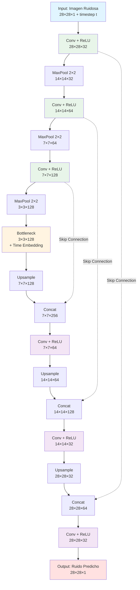

### Componentes Clave

#### 1. **Encoder (Camino Descendente)** 🔽
- **Propósito**: Extraer características y comprimir la imagen
- **Operaciones**: Convoluciones + Max Pooling
- **Efecto**: La imagen se hace más pequeña pero con más canales
- **Ejemplo**: 28×28×1 → 14×14×32 → 7×7×64 → 3×3×128

#### 2. **Bottleneck (Cuello de Botella)** 🎯
- **Propósito**: Representación más compacta de la información
- **Características**: Mayor número de canales, menor resolución espacial
- **Aquí se integra**: Time embedding (información sobre el timestep $t$)

#### 3. **Decoder (Camino Ascendente)** 🔼
- **Propósito**: Reconstruir la imagen a resolución original
- **Operaciones**: Convoluciones Transpuestas (Upsampling)
- **Efecto**: La imagen vuelve a crecer
- **Ejemplo**: 3×3×128 → 7×7×64 → 14×14×32 → 28×28×1

#### 4. **Skip Connections (Conexiones de Salto)** 🔗
- **El secreto de U-Net**: Conectan encoder directamente con decoder
- **Propósito**: Preservar detalles finos de la imagen original
- **Cómo funcionan**: Concatenan features del encoder con el decoder

### Flujo de Información con Skip Connections

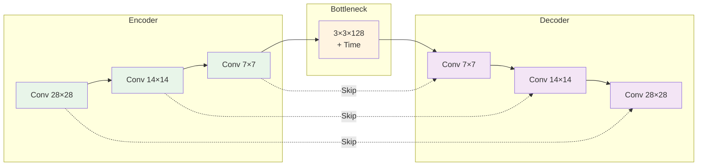

**¿Por qué son importantes las skip connections?**

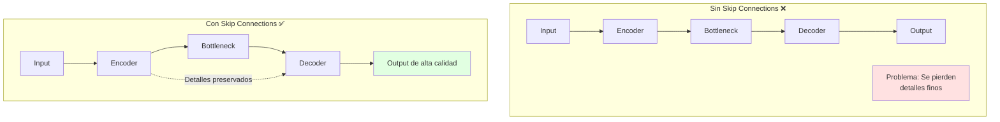

### Time Embedding en U-Net

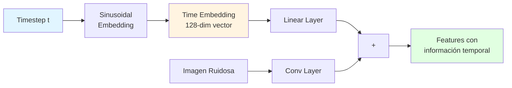

**¿Por qué?** El modelo necesita saber en qué paso $t$ estamos:
- En $t=10$: Hay poco ruido, predicción debe ser sutil
- En $t=900$: Hay mucho ruido, predicción debe ser más agresiva

### ¿Por qué U-Net para Modelos de Difusión?

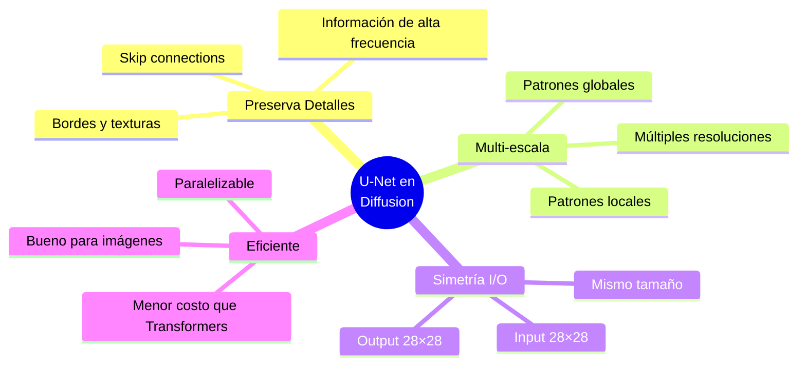

### Comparación con Otras Arquitecturas

| Arquitectura | Skip Connections | Tamaño I/O | U-Net en Diffusion |
|--------------|------------------|------------|---------------------|
| **CNN Simple** | ❌ No | Diferente | ❌ Pierde detalles |
| **ResNet** | ✅ Sí (internos) | Diferente | ⚠️ No diseñado para esto |
| **U-Net** | ✅ Sí (encoder→decoder) | Mismo | ✅ Perfecto |
| **Transformer** | ❌ No (usa atención) | Flexible | ⚠️ Costoso para imágenes |

### Proceso Completo en Diffusion

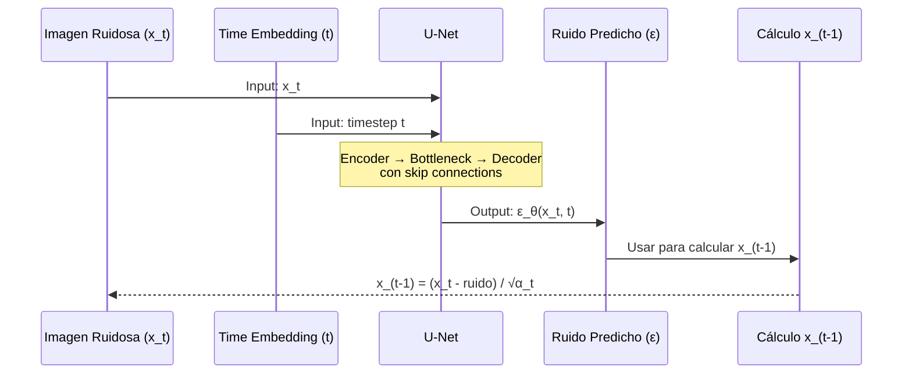

### Resumen Visual: La Forma de "U"

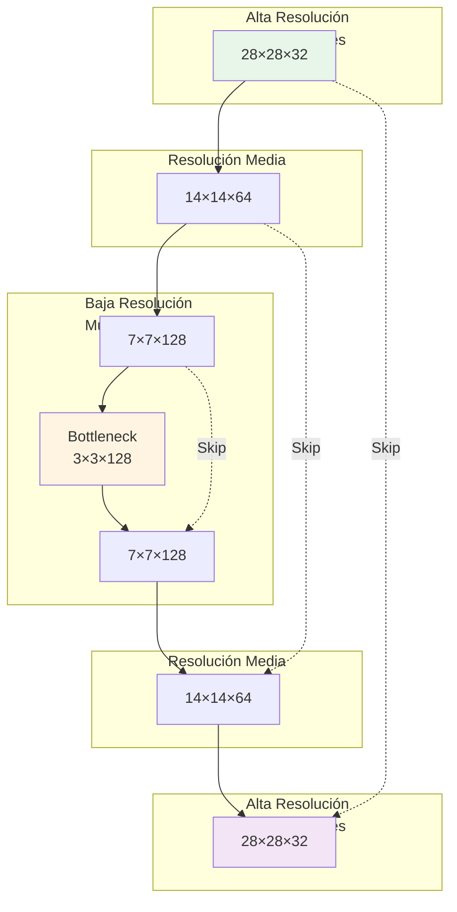

### Resumen: ¿Por qué U-Net es el Estándar?

1. ✅ **Arquitectura simétrica**: Input = Output en dimensiones
2. ✅ **Skip connections**: Preservan detalles cruciales para denoising
3. ✅ **Multi-escala**: Captura patrones globales y locales
4. ✅ **Eficiente**: Menor costo computacional que transformers para imágenes
5. ✅ **Probada**: Funciona excelentemente en tareas pixel-a-pixel

En modelos de difusión, U-Net es el "cerebro" que aprende a mirar una imagen ruidosa y decir: **"este es el ruido que tiene, déjame predecirlo para poder quitarlo"**.

---

## 🎨 Entendiendo los Canales en U-Net

### ¿Qué son los Canales?

**Analogía Simple:** Los canales son como "lentes mágicos" que miran la misma imagen desde diferentes perspectivas.

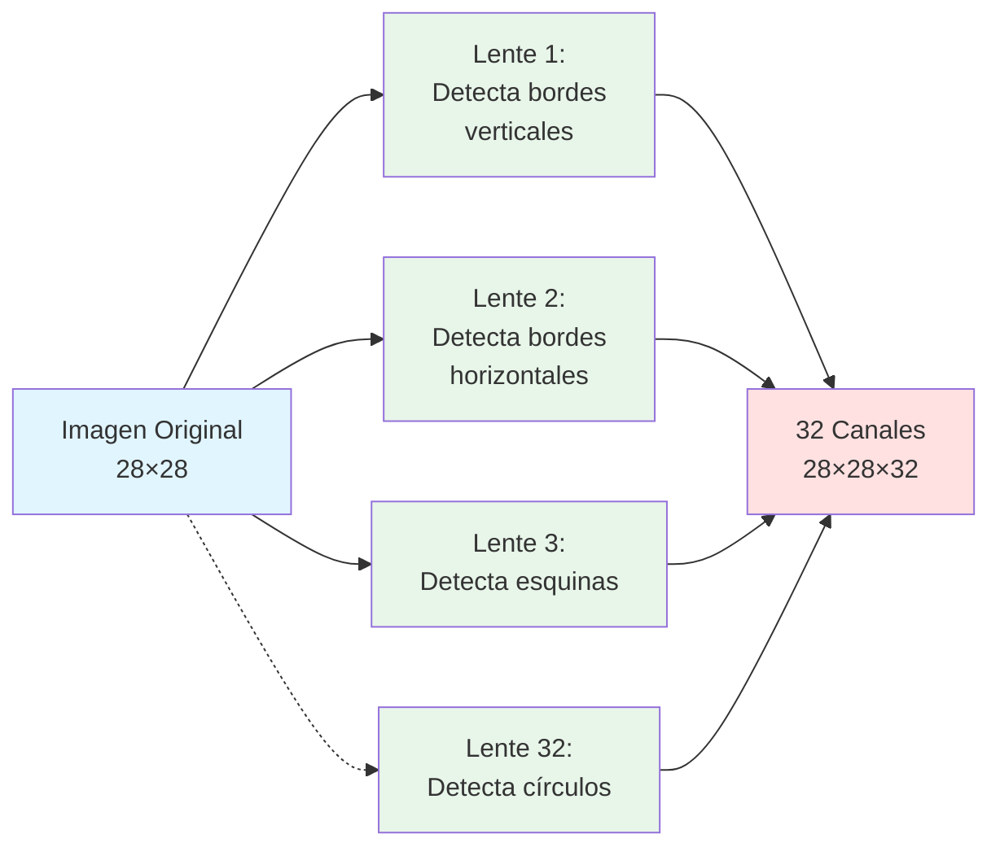

### Canales en Imágenes Normales vs Redes Neuronales

#### **Imágenes RGB (3 canales)**

```
Una foto a color tiene:
- Canal Rojo (R)   → Intensidades de rojo
- Canal Verde (G)  → Intensidades de verde
- Canal Azul (B)   → Intensidades de azul

Dimensiones: [Alto, Ancho, 3]
Ejemplo: [512, 512, 3]
```

#### **Redes Neuronales (N canales)**

En redes neuronales, los canales **NO son colores**, son **detectores de características**:

```
32 canales podrían detectar:
- Canal 1:  Bordes horizontales
- Canal 2:  Bordes verticales
- Canal 3:  Esquinas de 90°
- Canal 4:  Curvas suaves
- ...
- Canal 32: Algún patrón específico aprendido

Dimensiones: [Alto, Ancho, 32]
Ejemplo: [28, 28, 32]
```

### De 2D a 3D: El Flujo en U-Net

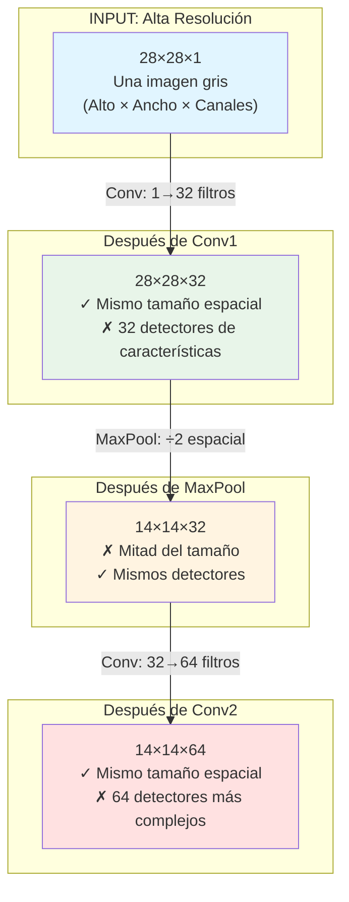

### Paso a Paso: ¿Qué Ocurre con las Dimensiones?

#### **Paso 1: Input → Conv1**

```
28×28×1  →  [Conv 32 filtros]  →  28×28×32

¿Qué pasó?
- Alto: 28 (se mantiene con padding)
- Ancho: 28 (se mantiene con padding)
- Canales: 1 → 32 (¡AUMENTÓ!)

¿Por qué?
Aplicamos 32 filtros diferentes, cada uno aprende a detectar algo distinto.
Es como tomar 32 "fotografías especializadas" de la misma imagen.
```

#### **Paso 2: Conv1 → MaxPool**

```
28×28×32  →  [MaxPool 2×2]  →  14×14×32

¿Qué pasó?
- Alto: 28 → 14 (¡SE REDUCE A LA MITAD!)
- Ancho: 28 → 14 (¡SE REDUCE A LA MITAD!)
- Canales: 32 (se mantiene)

¿Por qué?
MaxPool toma bloques de 2×2 pixeles y se queda con el máximo.
Reduce el tamaño espacial pero mantiene todos los detectores.
```

#### **Paso 3: MaxPool → Conv2**

```
14×14×32  →  [Conv 64 filtros]  →  14×14×64

¿Qué pasó?
- Alto: 14 (se mantiene)
- Ancho: 14 (se mantiene)
- Canales: 32 → 64 (¡AUMENTÓ OTRA VEZ!)

¿Por qué?
Ahora combinamos los 32 detectores anteriores para aprender
64 patrones MÁS COMPLEJOS y abstractos.
```

### Intuición: ¿Por qué Aumentan los Canales?

**Trade-off: Resolución Espacial ↔ Complejidad de Características**

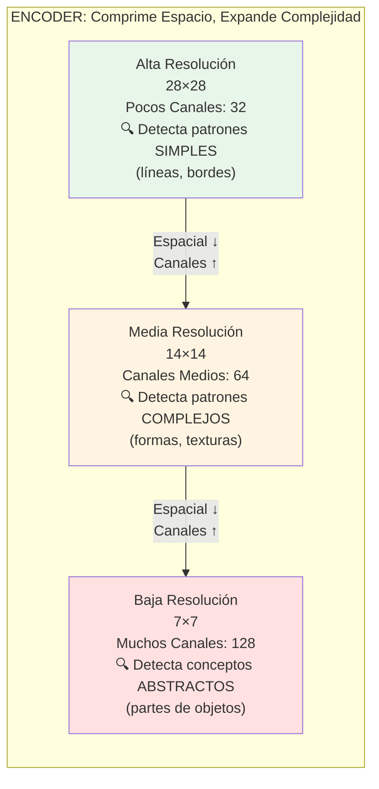

**Analogía:** Análisis de una fotografía de un gato

```
Nivel 1 (28×28×32):
  "Veo líneas, bordes, colores básicos"
  Patrones: | — / \ ○

Nivel 2 (14×14×64):
  "Veo formas como círculos, triángulos, texturas"
  Patrones: △ ○ ▢ rayas, puntos

Nivel 3 (7×7×128):
  "Veo un ojo, una oreja, bigotes - ¡es un gato!"
  Patrones: conceptos de partes de animales
```

**Principio Clave:** A medida que **reduces el tamaño espacial**, necesitas **más canales** para capturar información más compleja y abstracta.

### Tabla Completa: Encoder de U-Net

| Operación | Entrada | Salida | ¿Qué Detecta? |
|-----------|---------|--------|---------------|
| **Conv 32 filtros** | 28×28×1 | 28×28×32 | Patrones básicos (bordes, líneas) |
| **MaxPool 2×2** | 28×28×32 | 14×14×32 | Reduce tamaño, mantiene patrones |
| **Conv 64 filtros** | 14×14×32 | 14×14×64 | Combina patrones → formas complejas |
| **MaxPool 2×2** | 14×14×64 | 7×7×64 | Reduce tamaño |
| **Conv 128 filtros** | 7×7×64 | 7×7×128 | Combina formas → conceptos abstractos |
| **MaxPool 2×2** | 7×7×128 | 3×3×128 | Representación más compacta |

### Visualización: La Pirámide de Información

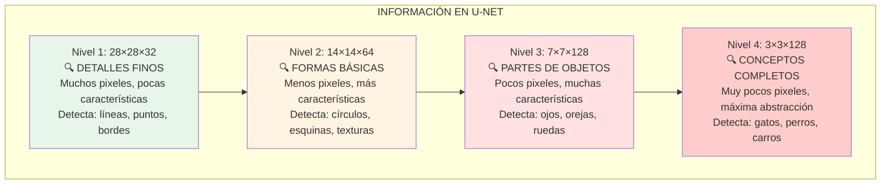

### Ejemplo Numérico Completo

Para un dígito MNIST `28×28×1`:

#### **Encoder (Compresión):**

```
INPUT:  28×28×1    (784 pixeles × 1 canal = 784 valores)
   ↓ Conv 32
LAYER1: 28×28×32   (784 pixeles × 32 canales = 25,088 valores)
   ↓ MaxPool
LAYER2: 14×14×32   (196 pixeles × 32 canales = 6,272 valores)
   ↓ Conv 64
LAYER3: 14×14×64   (196 pixeles × 64 canales = 12,544 valores)
   ↓ MaxPool
LAYER4: 7×7×64     (49 pixeles × 64 canales = 3,136 valores)
   ↓ Conv 128
LAYER5: 7×7×128    (49 pixeles × 128 canales = 6,272 valores)
   ↓ MaxPool
BOTTLENECK: 3×3×128 (9 pixeles × 128 canales = 1,152 valores)
```

#### **Decoder (Reconstrucción):**

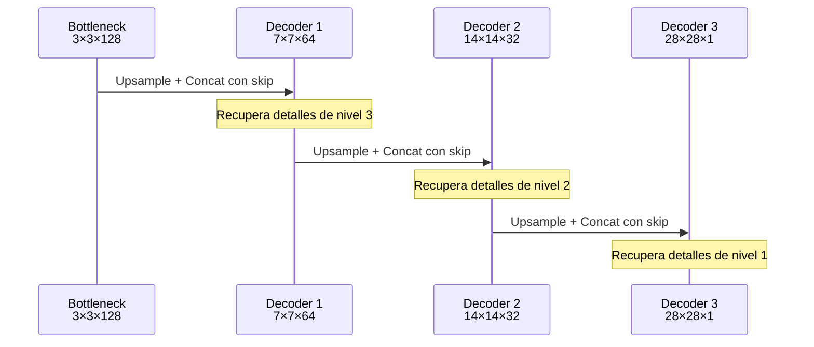

### Analogía Final: Libros y Resúmenes 📚

```
Libro Completo (28×28×32):
  📖 5000 palabras, conceptos básicos
  "El gato está en el jardín junto al árbol"

Capítulo Resumido (14×14×64):
  📄 500 palabras, ideas más densas
  "Gato en jardín natural"

Abstract (7×7×128):
  📋 50 palabras, conceptos muy comprimidos
  "Animal doméstico - exterior"

Título (3×3×128):
  📌 3 palabras, máxima abstracción
  "Gato Exterior"
```

**El truco:** Menos espacio (resolución) pero información más "densa" (canales).

### Resumen: Canales en U-Net

| Concepto | Explicación |
|----------|-------------|
| **¿Qué son?** | Detectores de características diferentes |
| **¿Por qué aumentan?** | Para capturar patrones más complejos en menos espacio |
| **Trade-off** | Resolución espacial ↓ = Canales ↑ |
| **Encoder** | Comprime espacio, expande complejidad |
| **Decoder** | Expande espacio, reduce complejidad |
| **Skip connections** | Preservan detalles finos durante reconstrucción |

---

## 🚀 Cómo Usar este Repositorio

### Prerrequisitos

```bash
pip install torch torchvision numpy matplotlib tqdm
pip install diffusers transformers accelerate pillow  # Para el notebook 2
```

### Orden Sugerido

1. **Principiantes**: Empieza con `diffusion_models_presentation.ipynb` para una visión general
2. **Implementación**: Continúa con `01_diffusion_fundamentals.ipynb` para entender los detalles
3. **Aplicaciones**: Termina con `02_text_to_image_diffusion.ipynb` para ver casos de uso reales

---

## 📖 Referencias

### Papers Fundamentales

- **[Denoising Diffusion Probabilistic Models (Ho et al., 2020)](https://arxiv.org/abs/2006.11239)** - El paper fundamental
- **[Deep Unsupervised Learning using Nonequilibrium Thermodynamics (Sohl-Dickstein et al., 2015)](https://arxiv.org/abs/1503.03585)** - Paper original
- **[CLIP (Radford et al., 2021)](https://arxiv.org/abs/2103.00020)** - Text encoder usado en DALL-E
- **[DALL-E 2 (Ramesh et al., 2022)](https://arxiv.org/abs/2204.06125)** - Modelo texto-a-imagen de OpenAI
- **[Latent Diffusion Models / Stable Diffusion (Rombach et al., 2022)](https://arxiv.org/abs/2112.10752)** - Difusión en espacio latente
- **[Imagen (Saharia et al., 2022)](https://arxiv.org/abs/2205.11487)** - Modelo de Google
- **[Classifier-Free Guidance (Ho & Salimans, 2022)](https://arxiv.org/abs/2207.12598)** - Técnica para mejorar generación

### Recursos Adicionales

- [Understanding Diffusion Models (Luo, 2022)](https://arxiv.org/abs/2208.11970) - Tutorial completo
- [The Annotated Diffusion Model](https://huggingface.co/blog/annotated-diffusion) - Implementación comentada
- [Stable Diffusion GitHub](https://github.com/Stability-AI/stablediffusion) - Código oficial
- [Hugging Face Diffusers](https://huggingface.co/docs/diffusers/index) - Librería de difusión
- [The Illustrated Stable Diffusion](https://jalammar.github.io/illustrated-stable-diffusion/) - Visualización intuitiva

---

## 🤝 Contribuciones

Si encuentras errores o tienes sugerencias para mejorar estos materiales educativos, siéntete libre de contribuir.

---

## 📝 Licencia

Materiales educativos para uso académico.

---

**¡Feliz aprendizaje sobre Modelos de Difusión!** 🎉

